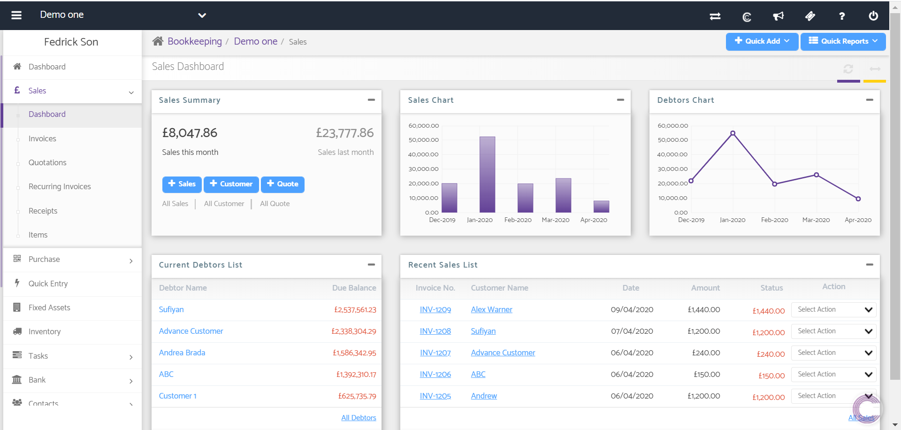
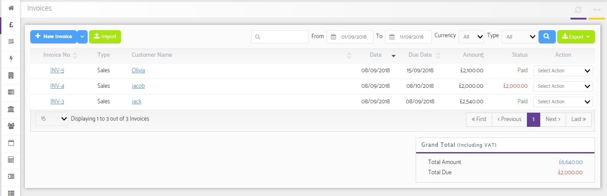
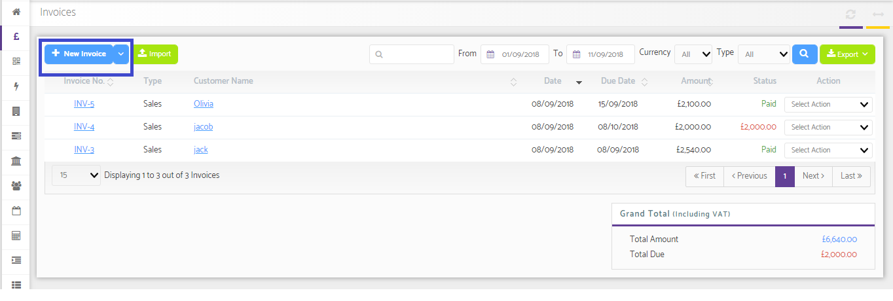
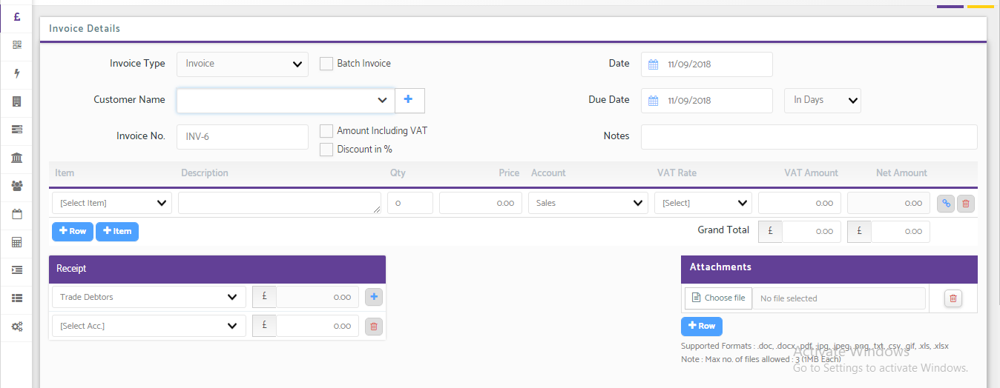

# Sales Dashboard
	 	
			
			Print

- **Category:** Bookkeeping
- **Folder:** Bookkeeping Help Guide
- **Source URL:** [https://capium.freshdesk.com/support/solutions/articles/9000165179-sales-dashboard](https://capium.freshdesk.com/support/solutions/articles/9000165179-sales-dashboard)
- **Article ID:** 9000165179

## Content

Solution home 
		Bookkeeping
		Bookkeeping Help Guide

### Sales Dashboard

			Print

	Modified on: Thu, 9 Apr, 2020 at 12:44 PM

		Location: Bookkeeping module > Dashboard > Client specific > Sales Section

Refer to the link 

You can create a new Sales invoice by clicking on the “+Sales” button.

The Sales section houses the below features;

1. Sales chart

2. Debtors Chart

3. Current Debtor list

 - You can click on the individual debtor to view detailed information
 - It contains debtors Name and Due balance
4. Recent sales list

 - You can click on the individual customer to view detailed information
 - You can click on Invoice No. to view the invoice.
 - It also contains Date, Amount, Status.
 - You can also select the action for each customer from action drop down - Edit
 - Delete
 - Download document
 - Download PDF
 - Mail Invoice
 - Add receipt
 - Copy Invoice

Watch the video here 

### 

### Viewing Sales Invoice

It is a document issued by a seller to a buyer indicating items sold, prices, date of shipment, delivery and payment terms.

Watch an overview of your sales invoices here

Invoice No.: This Lists the various Invoices created. As you click on this a Sales Invoice Detail Pop-up will appear where you can view the details of the Invoice. You may also take a copy in Word and PDF format by clicking on the Icons on upper right navigation

Type: It shows the Type whether the Invoice is Sales or Credit Note

Customer name: This shows the name of the Customer to whom the sales have been made. As you click on the Customer name it will redirect you to Customer Details page where you may view all the details regarding the same

Date: It shows the date on which Invoice has been created

Due Date: It shows the date on which the Invoice becomes due

Amount: It shows the total amount of the Invoice

Status: This shows the status i.e. how much amount is being received against the Invoice. If the amount is received in full then the status is changed to Paid

Action Dropdown: It lets you take various actions such as:

Edit

Delete

Download Doc

Download PDF

Email

Add Receipt

Copy

You are also provided with the options to Import and Export the Invoices. Also, you can search a particular invoice from the search option. The ‘From’ and ‘To’ columns let you set the dates and view the Sales made during a particular period. Currency drop-down lets you set a particular currency in which transactions are done. The Type drop-down lets you set the nature of Invoice i.e. Sales, Credit Note, Draft, Recurring.

### Adding New Invoice   

It is a document issued by a seller to a buyer indicating items sold, prices, date of shipment, delivery and payment terms.

Watch how to create an invoice

To Add a New Invoice, you need to click on “+Sales” Button. Click on this button and it will redirect you to Create New Invoice page. The various functionalities are being discussed below:

Invoice Type drop-down: From the Invoice Type drop-down you may select the type i.e. whether you have to create an Invoice or a Credit note.

Batch Invoice: As you tick on this check box it will allow you to create the same Invoice for multiple customers.

Customer Name dropdown: This dropdown lets you select a particular customer from the various customers listed. You may also add a contact (customer) by clicking on the add button listed beside the drop-down.

Invoice No: This box shows the Invoice no automatically as you create a new Invoice.

Amount Including VAT: If you tick this checkbox then the Price of the product will include VAT and vice versa.

Date: This will display the current date. You may also change it as per your requirement.

 - 
### Due Date: It will also take the current date however if the payment is to be received later on then you may set it accordingly or also you can select the period from the dropdown beside.

### Invoice Details

### After filling in the above details you now need to mention the particular details as per the Invoice you are creating, such as:

Item

Description

Quantity

Price

Account

VAT Rate

VAT Amount

A new Item can also be added by clicking on the +Item Tab.

The Receipt Column by default considers the whole amount of the Invoice under Trade Debtors. This can be allocated accordingly there itself it the amount is received in Part or Full. Two dropdowns are available for the same where you may select the particular Cash, Bank or Director's account under which payment is received.

You may also save it as a Draft. This option will not allow including the same in accounts.

You may now ‘save and close’ the Invoice so created or can also ‘save and create new’ with the help of button available in the bottom right corner.

Click here to watch how to delete an invoice

How to delete invoice with receipts allocated 

										Did you find it helpful?
								Yes
								No

Send feedback	Sorry we couldn't be helpful. Help us improve this article with your feedback.

## Screenshots & Diagrams (4)

