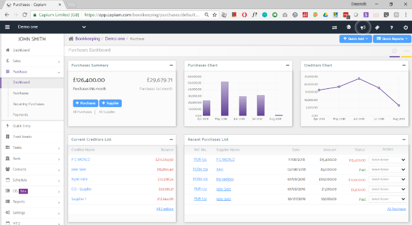

# Purchase Dashboard
	 	
			
			Print

- **Category:** Bookkeeping
- **Folder:** Bookkeeping Help Guide
- **Source URL:** [https://capium.freshdesk.com/support/solutions/articles/9000165180-purchase-dashboard](https://capium.freshdesk.com/support/solutions/articles/9000165180-purchase-dashboard)
- **Article ID:** 9000165180

## Content

Solution home 
		Bookkeeping
		Bookkeeping Help Guide

### Purchase Dashboard

			Print

	Modified on: Thu, 9 Apr, 2020 at  3:54 PM

### Location: Bookkeeping module > Dashboard > Client specific > Purchase
The purchases dashboard lets the user have a quick view on various sections such as:

You can watch a video for more here

Purchases Summary: This box shows the figures for the purchases made this month as well as the last month. Moreover, it allows the user to Add purchases and Supplier from the buttons provided thereof. Also, the user can view all the purchases made along with the no. of suppliers.

Purchases Chart: It is a bar diagram which gives a short summary of the purchases made per month. The Months are listed on the X-axis whereas the Amount of purchases made is listed on the Y-axis.

Creditors Chart: It is a line diagram on which the amount due to creditors per month is being shown. The months are listed on the X-axis whereas the Amount due to creditors is listed on the Y-axis.

Current creditors list:

This box contains the names of the creditors whom the amount is yet to be paid. The creditor with the highest outstanding amount stands first in the list. As you click on the creditors name it will redirect you to Contacts>>Suppliers. On this page, you can see the complete details regarding a particular creditor.

Recent Purchases List: In this box, you may view the various Purchase Invoices so created. Under the Ref. No. column various purchase invoices are listed. As you click on the Purchase Invoice no. a popup will appear. This shows the complete data regarding a purchase invoice. You may also download a PDF of the same by clicking on the PDF. As you click on the Customer Name you will be redirected to the Contact Details Page. The date column shows the particular date on which the purchase has been booked. The Amount column shows the total amount pertaining to the Purchase. The status will show the total amount pending or if it is paid then the status will be shown as paid. The Action Dropdown lets you take the following actions:

Edit Purchase

Delete Purchase

Download PDF

Add Payment

Copy Invoice

Note: Once you allocate amount by editing Invoice the system will not allow you to ‘Edit

Purchase’ unless you Unallocated Amount.

										Did you find it helpful?
								Yes
								No

Send feedback	Sorry we couldn't be helpful. Help us improve this article with your feedback.

## Screenshots & Diagrams (1)

