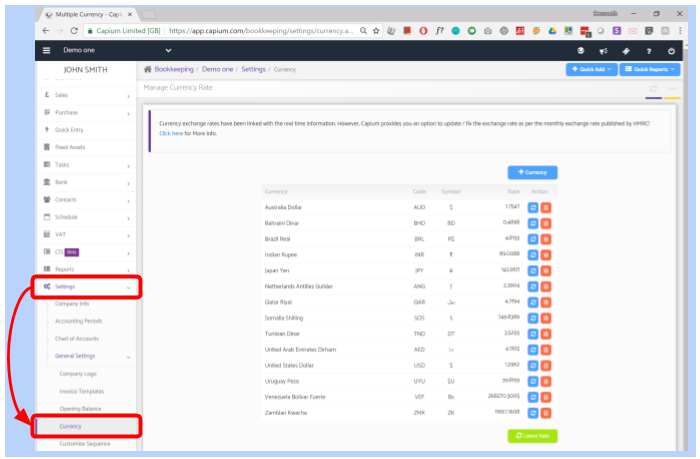

# Multi-currency
	 	
			
			Print

- **Category:** Bookkeeping
- **Folder:** Bookkeeping Help Guide
- **Source URL:** [https://capium.freshdesk.com/support/solutions/articles/9000165209-multi-currency](https://capium.freshdesk.com/support/solutions/articles/9000165209-multi-currency)
- **Article ID:** 9000165209

## Content

Solution home 
		Bookkeeping
		Bookkeeping Help Guide

### Multi-currency

			Print

	Modified on: Mon, 23 Aug, 2021 at 12:53 PM

		Location:  Bookkeeping module > Dashboard > Client specific > Settings > General Settings > Currency

Click here to watch a video on how to add currencies

Click here to enter a custom booked currency rate

Help/Guide 

This page shows the list of currency business is dealing in.

The current rate of that currency against home currency will be calculated automatically.

Latest Rate Button if you click on it, Automatic rates are fetched.

Foreign currencies are relevant while creating the Invoices and any transfer directly to a foreign bank.

Edit option is there to edit the rate.

The delete option is there to delete currency

										Did you find it helpful?
								Yes
								No

Send feedback	Sorry we couldn't be helpful. Help us improve this article with your feedback.

## Screenshots & Diagrams (1)

