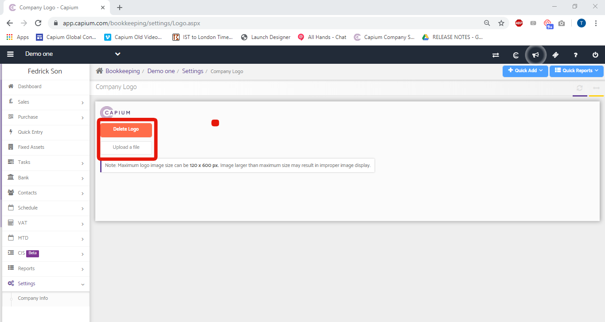

# Adding a company logo
	 	
			
			Print

- **Category:** Bookkeeping
- **Folder:** Bookkeeping Help Guide
- **Source URL:** [https://capium.freshdesk.com/support/solutions/articles/9000165217-adding-a-company-logo](https://capium.freshdesk.com/support/solutions/articles/9000165217-adding-a-company-logo)
- **Article ID:** 9000165217

## Content

Solution home 
		Bookkeeping
		Bookkeeping Help Guide

### Adding a company logo

			Print

	Modified on: Mon, 23 Aug, 2021 at  1:03 PM

		Location:  Bookkeeping module > Client dashboard > Settings > General Settings >Company Logo

Refer to the link

Please click here to watch how to add a company logo

Help/Guide:

You are able to upload a logo of the company from your internal hard drive, and once that is uploaded to Capium, it will reflect in the PDF version of your invoices.

Head to the Company logo section from the navigation above and click 'Upload a file'. You can also delete the logo from the Delete Logo button.

										Did you find it helpful?
								Yes
								No

Send feedback	Sorry we couldn't be helpful. Help us improve this article with your feedback.

## Screenshots & Diagrams (1)

