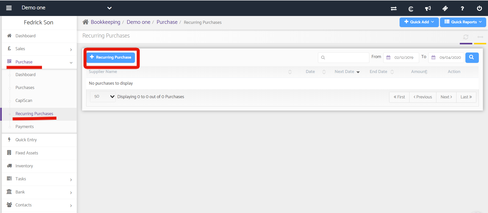

# Recurring Purchases
	 	
			
			Print

- **Category:** Bookkeeping
- **Folder:** Bookkeeping Help Guide
- **Source URL:** [https://capium.freshdesk.com/support/solutions/articles/9000165218-recurring-purchases](https://capium.freshdesk.com/support/solutions/articles/9000165218-recurring-purchases)
- **Article ID:** 9000165218

## Content

Solution home 
		Bookkeeping
		Bookkeeping Help Guide

### Recurring Purchases

			Print

	Modified on: Thu, 9 Apr, 2020 at  4:53 PM

### Recurring Purchases

Location: Bookkeeping module > Dashboard > Client specific > Purchase > Recurring Purchases

Refer to the link 

Click here to watch how to setup recurring purchases

Click here to watch how to stop recurring purchases 

You need to fill in the following details:

Supplier name: The Supplier name can be selected from the drop-down also you may add a new one by clicking on the plus button.

Repeat After: You may provide a particular period after which the purchase will reoccur.

Reference: It can be given as per the user requirement.

Amount Including VAT: if you want to include the Vat amount in the total amount of Invoice then tick this checkbox.

Date: It is the date on which the Invoice has to be created.

Due Date: It can be set as per your requirement. The no of days can be entered and the period can be selected from the drop-down.

End Date: This the date on which the recurrence of Purchase Invoice ends. You need to put this as per your requirement.

Next Due date: This is system generated and will be shown once the Invoice is created and not before that.

You need to fill in the details pertaining to the invoice as per your requirement and click on save.

										Did you find it helpful?
								Yes
								No

Send feedback	Sorry we couldn't be helpful. Help us improve this article with your feedback.

## Screenshots & Diagrams (1)

