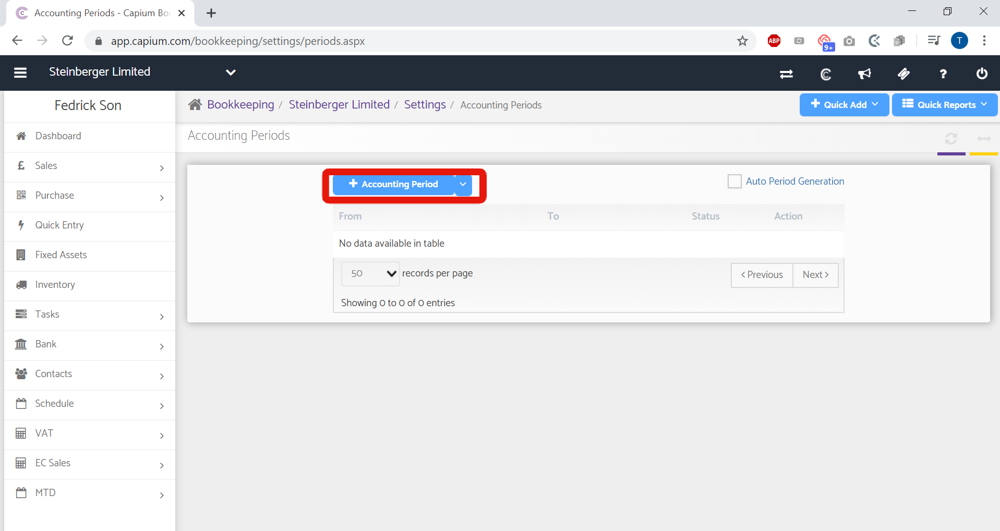
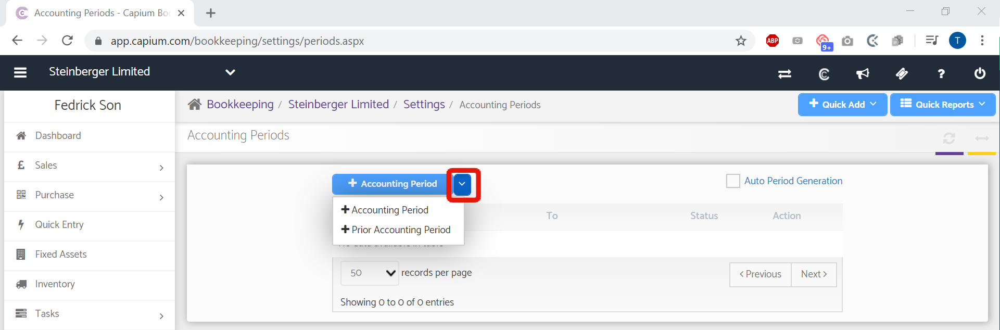

# Adding an Accounting Period
	 	
			
			Print

- **Category:** Bookkeeping
- **Folder:** Bookkeeping Help Guide
- **Source URL:** [https://capium.freshdesk.com/support/solutions/articles/9000165221-adding-an-accounting-period](https://capium.freshdesk.com/support/solutions/articles/9000165221-adding-an-accounting-period)
- **Article ID:** 9000165221

## Content

Solution home 
		Bookkeeping
		Bookkeeping Help Guide

### Adding an Accounting Period

			Print

	Modified on: Fri, 13 Mar, 2020 at 10:37 AM

		Location:  Bookkeeping module >> Dashboard >> Client specific >> Settings >> Accounting Period

Refer to the link  

Help/Guide 

An accounting period, in bookkeeping, is the period with reference to which accounting books of any business are prepared. 

Head to the Bookkeeping module and follow the navigation above to the Accounting Periods page. Once there you simply need to click the +Accounting Period to add a new period.

On clicking +Accounting Period,

From and to period can be entered

Accounts due date and CT600 Due date: Based on the Accounting period you set, the system fetches the due dates for submission of Accounts and CT600 according to the norms of HMRC and Companies House

Lock Previous period: If this function is selected, transactions cannot be edited for the previous period

Is Company ceased: You need to tick this checkbox if your company is ceased

Auto period generation: if Auto period generation is selected then once the current period end date is reached, the system will automatically generate new accounting period

Prior Accounting Period

You can also set up a Prior Accounting period by clicking the drop down menu as displayed below

Click here to watch how to create an accounting period

Click here to watch how to setup a prior accounting period

Click here to watch how to delete an accounting period

										Did you find it helpful?
								Yes
								No

Send feedback	Sorry we couldn't be helpful. Help us improve this article with your feedback.

## Screenshots & Diagrams (2)

