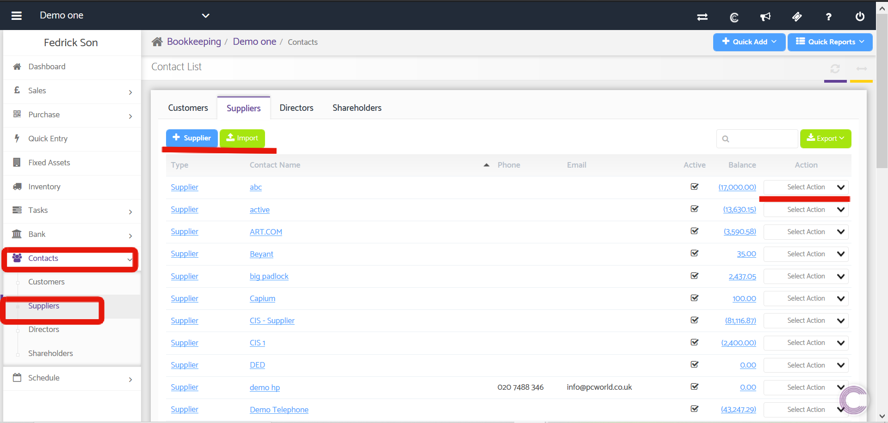
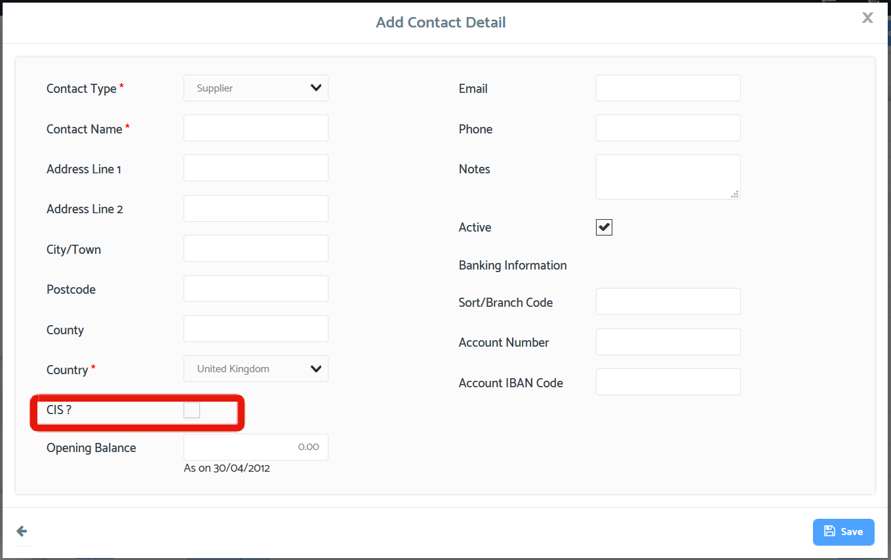
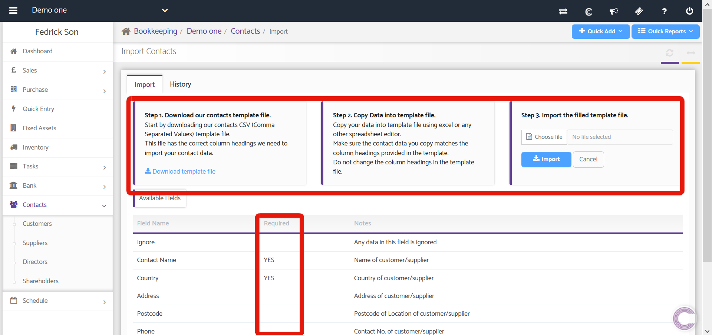

# Contacts - Suppliers
	 	
			
			Print

- **Category:** Bookkeeping
- **Folder:** Bookkeeping Help Guide
- **Source URL:** [https://capium.freshdesk.com/support/solutions/articles/9000165229-contacts-suppliers](https://capium.freshdesk.com/support/solutions/articles/9000165229-contacts-suppliers)
- **Article ID:** 9000165229

## Content

Solution home 
		Bookkeeping
		Bookkeeping Help Guide

### Contacts - Suppliers

			Print

	Modified on: Fri, 22 May, 2020 at  1:42 PM

		Location:  Bookkeeping module > Dashboard > Client specific > Contacts > Suppliers

Click here to watch the video

Using the Contact option from the Select Contact drop-down, you will be able to see details regarding the contact and you can also edit that contact's details by clicking on the Edit button available on the upper right corner of the window. The Account Status shows the Total Amount due to the suppliers (Payment) minus any advance and the due balance. 

The Purchases and Outstanding show the purchase figures for six months. The recent Transaction Row shows the various Purchases and Payments pertaining to the purchases. You are able to Allocate, Unallocated or Delete a particular purchase from the Action Dropdown. 

You can view Purchases for a particular period by setting the period in From and To frequency.

Phone: It shows the phone from the Supplier

Email: It shows the Email address of the Supplier

Active: It lets you know whether the Supplier is Active or Inactive.

Balance: It shows the Balance which is due to the Supplier. As you click on this it will redirect you to contact details page.

Action: It allows you to Edit or Deletes a contact from the database.

To Add a new Supplier you need to click on +Suppliers button. As you click on this a Popup appears. As seen in the bottom left image.

On Clicking Import button download the template file, copy data into the template file and Import the file. As import function is a generic one Customers and Suppliers can be imported with a single file. As seen in the bottom right image.

### Adding a Supplier

### 

### Importing a Supplier

### 

										Did you find it helpful?
								Yes
								No

Send feedback	Sorry we couldn't be helpful. Help us improve this article with your feedback.

## Screenshots & Diagrams (3)

