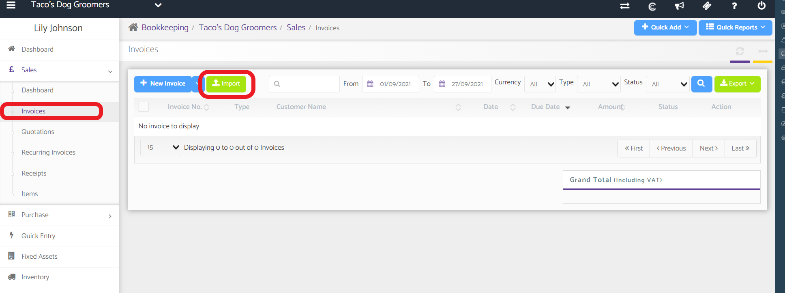

# How can we import created invoices from a different software onto Capium?
	 	
			
			Print

- **Category:** Bookkeeping
- **Folder:** Bookkeeping FAQs
- **Source URL:** [https://capium.freshdesk.com/support/solutions/articles/9000165286-how-can-we-import-created-invoices-from-a-different-software-onto-capium-](https://capium.freshdesk.com/support/solutions/articles/9000165286-how-can-we-import-created-invoices-from-a-different-software-onto-capium-)
- **Article ID:** 9000165286

## Content

Solution home 
		Bookkeeping
		Bookkeeping FAQs

### How can we import created invoices from a different software onto Capium?

			Print

	Modified on: Thu, 21 Oct, 2021 at 10:52 AM

		You may Import invoices by navigating to Bookkeeping>>Sales>>Invoices>>Import button. Download the template file then copy the data into the template file then Import. 

Click here to watch the video

Purchase Invoice - Import by navigating to Bookkeeping>>Purchase>>Import button. Download the template file then copy the data into the template file then Import.

Click here to watch the video

										Did you find it helpful?
								Yes
								No

Send feedback	Sorry we couldn't be helpful. Help us improve this article with your feedback.

## Screenshots & Diagrams (1)

