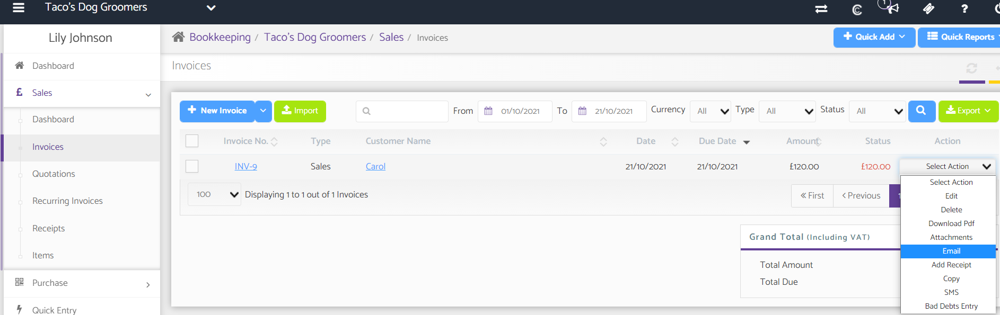
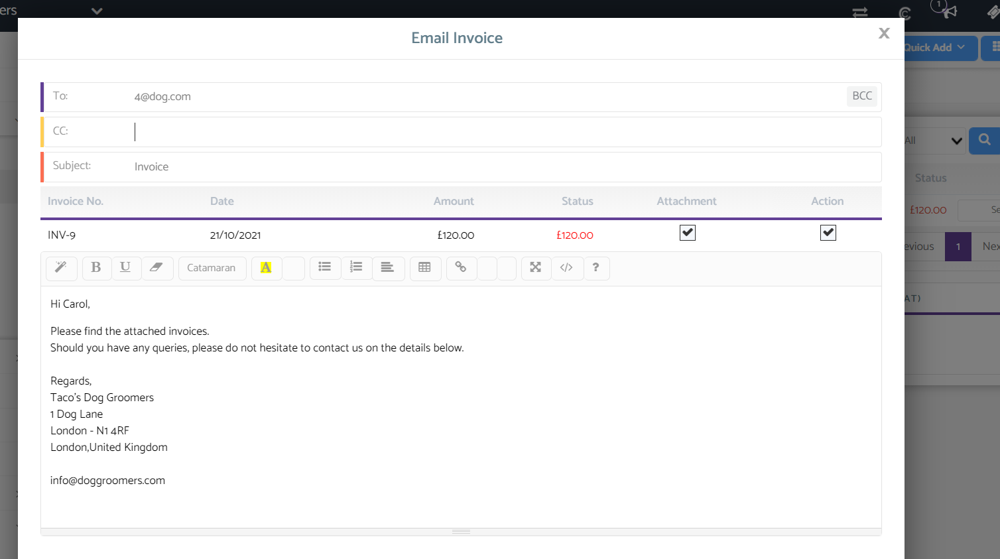
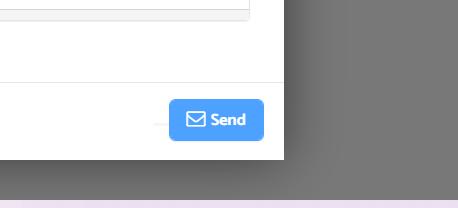

# Can sales invoices be sent automatically?
	 	
			
			Print

- **Category:** Bookkeeping
- **Folder:** Bookkeeping FAQs
- **Source URL:** [https://capium.freshdesk.com/support/solutions/articles/9000165290-can-sales-invoices-be-sent-automatically-](https://capium.freshdesk.com/support/solutions/articles/9000165290-can-sales-invoices-be-sent-automatically-)
- **Article ID:** 9000165290

## Content

Solution home 
		Bookkeeping
		Bookkeeping FAQs

### Can sales invoices be sent automatically?

			Print

	Modified on: Thu, 21 Oct, 2021 at  2:59 PM

		Right now, in bookkeeping invoices cannot be sent automatically,

To send an invoice please go to 

Bookkeeping > Select a client > Sales > Invoices

Then click the action dropdown button and select the "Email" option 

Please see the example email below, 

The customers email will be auto populated, you can add further email addresses

You can add CC and BCC recipients

Please then click to send

										Did you find it helpful?
								Yes
								No

Send feedback	Sorry we couldn't be helpful. Help us improve this article with your feedback.

## Screenshots & Diagrams (3)

