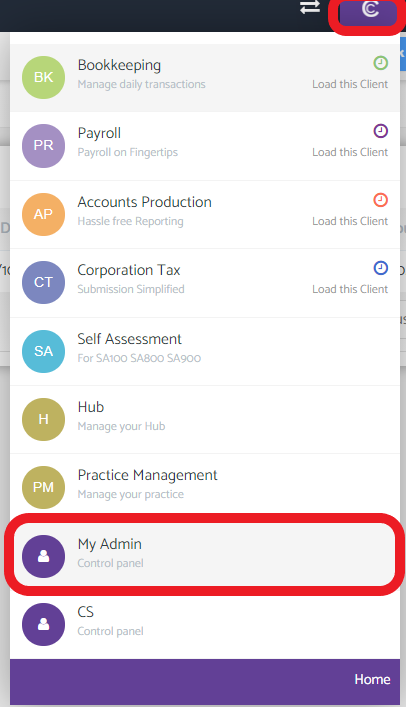
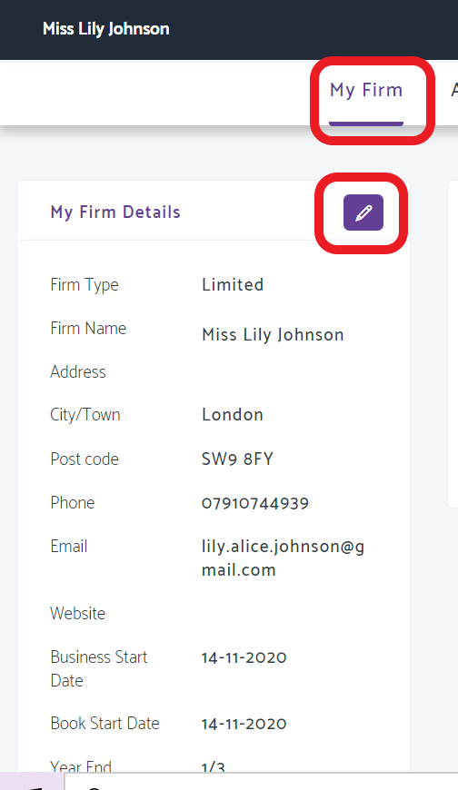

# How can I show a trading name on my invoices which I sent out to clients?
	 	
			
			Print

- **Category:** Bookkeeping
- **Folder:** Bookkeeping FAQs
- **Source URL:** [https://capium.freshdesk.com/support/solutions/articles/9000165293-how-can-i-show-a-trading-name-on-my-invoices-which-i-sent-out-to-clients-](https://capium.freshdesk.com/support/solutions/articles/9000165293-how-can-i-show-a-trading-name-on-my-invoices-which-i-sent-out-to-clients-)
- **Article ID:** 9000165293

## Content

Solution home 
		Bookkeeping
		Bookkeeping FAQs

### How can I show a trading name on my invoices which I sent out to clients?

			Print

	Modified on: Fri, 22 Oct, 2021 at  3:51 PM

		Yes, you can!

Please head to My Admin, by clicking on the C button on the right had corner.

Please then click on My Firm and then the edit button

When the firm name is edited this will reflect on invoices

										Did you find it helpful?
								Yes
								No

Send feedback	Sorry we couldn't be helpful. Help us improve this article with your feedback.

## Screenshots & Diagrams (2)

