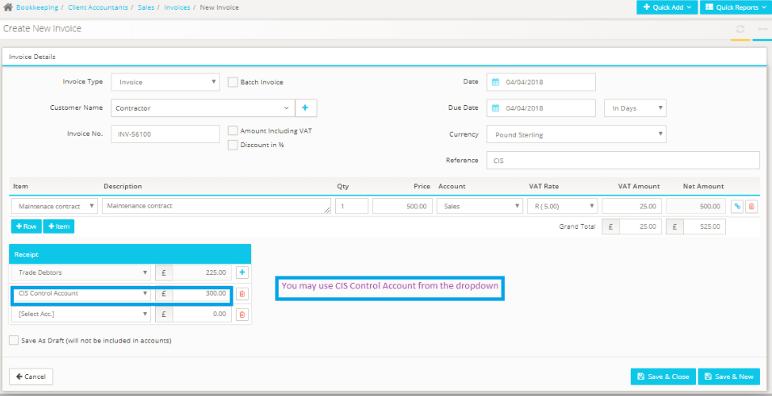

# Where in the bookkeeping module do we enter the CIS deductions?
	 	
			
			Print

- **Category:** Bookkeeping
- **Folder:** Bookkeeping FAQs
- **Source URL:** [https://capium.freshdesk.com/support/solutions/articles/9000165313-where-in-the-bookkeeping-module-do-we-enter-the-cis-deductions-](https://capium.freshdesk.com/support/solutions/articles/9000165313-where-in-the-bookkeeping-module-do-we-enter-the-cis-deductions-)
- **Article ID:** 9000165313

## Content

Solution home 
		Bookkeeping
		Bookkeeping FAQs

### Where in the bookkeeping module do we enter the CIS deductions?

			Print

	Modified on: Mon, 25 Oct, 2021 at  3:48 PM

		You may deduct the CIS amount while creating invoice itself. In the Receipts section by selecting "CIS Control Account" from the action drop down available

Navigation: Bookkeeping >> Select Client >> Sales > > Invoices >> + New Invoice

Once clicking the + New invoice button

Add in the details as follows, the reconcile the receipt to the CIS Control Account

Click here to watch how to account for CIS deductions for contractors

										Did you find it helpful?
								Yes
								No

Send feedback	Sorry we couldn't be helpful. Help us improve this article with your feedback.

## Screenshots & Diagrams (2)

