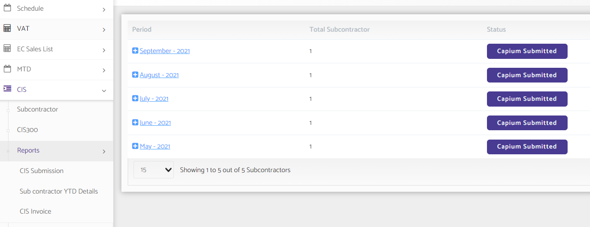
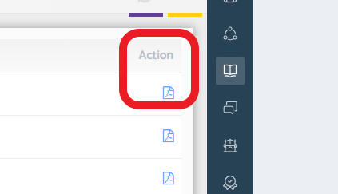

# How to generate a CIS Report?
	 	
			
			Print

- **Category:** Bookkeeping
- **Folder:** Bookkeeping FAQs
- **Source URL:** [https://capium.freshdesk.com/support/solutions/articles/9000165315-how-to-generate-a-cis-report-](https://capium.freshdesk.com/support/solutions/articles/9000165315-how-to-generate-a-cis-report-)
- **Article ID:** 9000165315

## Content

Solution home 
		Bookkeeping
		Bookkeeping FAQs

### How to generate a CIS Report?

			Print

	Modified on: Mon, 25 Oct, 2021 at  3:11 PM

		You can generate a CIS Report in Bookkeeping

Navigation: Bookkeeping >> Select Client >> CIS >> Reports 

Please click on the pdf button under action to download the report

Click here to watch how to view / download CIS reports

										Did you find it helpful?
								Yes
								No

Send feedback	Sorry we couldn't be helpful. Help us improve this article with your feedback.

## Screenshots & Diagrams (2)

