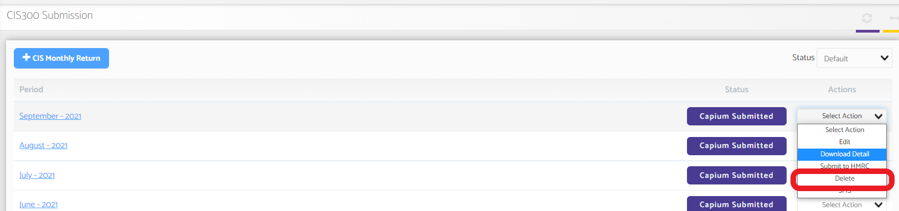

# Can I submit an amended CIS return?
	 	
			
			Print

- **Category:** Bookkeeping
- **Folder:** Bookkeeping FAQs
- **Source URL:** [https://capium.freshdesk.com/support/solutions/articles/9000165316-can-i-submit-an-amended-cis-return-](https://capium.freshdesk.com/support/solutions/articles/9000165316-can-i-submit-an-amended-cis-return-)
- **Article ID:** 9000165316

## Content

Solution home 
		Bookkeeping
		Bookkeeping FAQs

### Can I submit an amended CIS return?

			Print

	Modified on: Mon, 25 Oct, 2021 at  3:19 PM

		Yes you can, You need to first contact HMRC and ask them to delete the CIS Return of the desired period from their record. 

Once done you may delete the HMRC submitted CIS return by following this navigation.

Navigation: Bookkeeping>> Select Client >> CIS>>CIS300>>Action Drop down>>click on delete 

From then you may prepare and submit another CIS return for the same period again and submit it to HMRC. 

We would further recommend you to please download the response of HMRC from the action drop-down before deleting any return. 

Please click to find out more about CIS in Capium

										Did you find it helpful?
								Yes
								No

Send feedback	Sorry we couldn't be helpful. Help us improve this article with your feedback.

## Screenshots & Diagrams (1)

