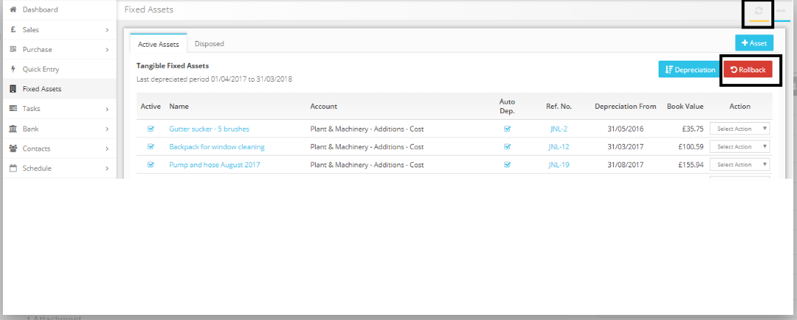
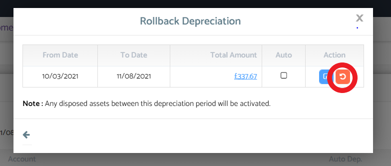

# How to dispose an asset after running the depreciation?
	 	
			
			Print

- **Category:** Bookkeeping
- **Folder:** Bookkeeping FAQs
- **Source URL:** [https://capium.freshdesk.com/support/solutions/articles/9000165322-how-to-dispose-an-asset-after-running-the-depreciation-](https://capium.freshdesk.com/support/solutions/articles/9000165322-how-to-dispose-an-asset-after-running-the-depreciation-)
- **Article ID:** 9000165322

## Content

Solution home 
		Bookkeeping
		Bookkeeping FAQs

### How to dispose an asset after running the depreciation?

			Print

	Modified on: Fri, 12 Nov, 2021 at  3:22 PM

		Navigation: Bookkeeping > Select Client > Fixed Assets > Active Assets

Please press the roll back button shown below

The following pop up will show, please click the rollback button.

Once confirmed this will roll back your previous depreciation.

										Did you find it helpful?
								Yes
								No

Send feedback	Sorry we couldn't be helpful. Help us improve this article with your feedback.

## Screenshots & Diagrams (2)

