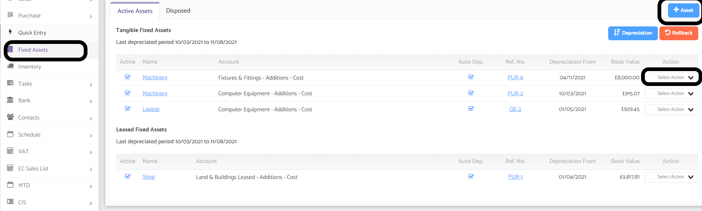
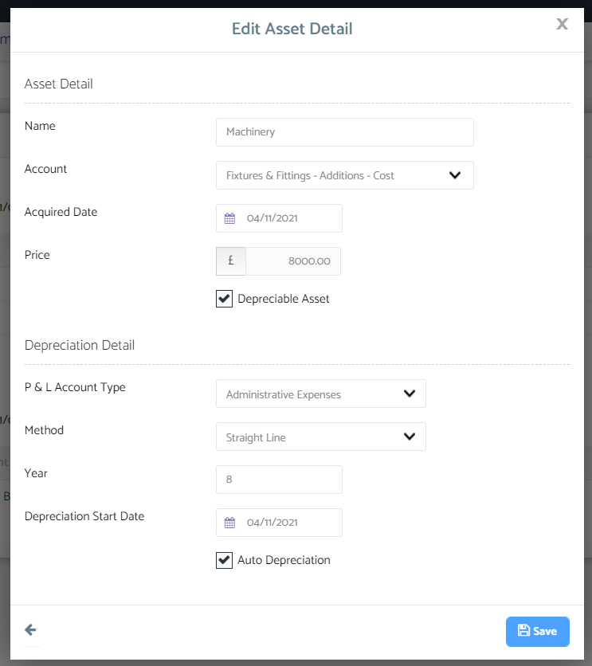

# Can I Create a Depreciation Journal?
	 	
			
			Print

- **Category:** Bookkeeping
- **Folder:** Bookkeeping FAQs
- **Source URL:** [https://capium.freshdesk.com/support/solutions/articles/9000165323-can-i-create-a-depreciation-journal-](https://capium.freshdesk.com/support/solutions/articles/9000165323-can-i-create-a-depreciation-journal-)
- **Article ID:** 9000165323

## Content

Solution home 
		Bookkeeping
		Bookkeeping FAQs

### Can I Create a Depreciation Journal?

			Print

	Modified on: Wed, 17 Nov, 2021 at  4:16 PM

		Location: Bookkeeping module > Dashboard > Client specific > Fixed Assets

You can create a auto depreciation journal through Fixed Assets

Please create the asset first, by clicking + Asset

Then please click on action next to the created asset and click on edit / explain and then fill out the depreciation pop up as needed

										Did you find it helpful?
								Yes
								No

Send feedback	Sorry we couldn't be helpful. Help us improve this article with your feedback.

## Screenshots & Diagrams (2)

