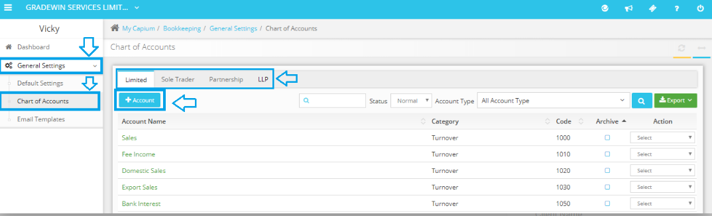

# Is it possible to set up a general chart of accounts?
	 	
			
			Print

- **Category:** Bookkeeping
- **Folder:** Bookkeeping FAQs
- **Source URL:** [https://capium.freshdesk.com/support/solutions/articles/9000165324-is-it-possible-to-set-up-a-general-chart-of-accounts-](https://capium.freshdesk.com/support/solutions/articles/9000165324-is-it-possible-to-set-up-a-general-chart-of-accounts-)
- **Article ID:** 9000165324

## Content

Solution home 
		Bookkeeping
		Bookkeeping FAQs

### Is it possible to set up a general chart of accounts?

			Print

	Modified on: Wed, 17 Nov, 2021 at  4:17 PM

		You can update the Master Chart of Accounts, which will be applicable to all your clients. To update the Nominal Codes.

Navigation: Bookkeeping > General Settings > Chart of Accounts

Click here to watch a video on how to update the Master Chart of Accounts

Click here to watch how to make nominal codes active / inactive

Settings>>general settings

										Did you find it helpful?
								Yes
								No

Send feedback	Sorry we couldn't be helpful. Help us improve this article with your feedback.

## Screenshots & Diagrams (1)

