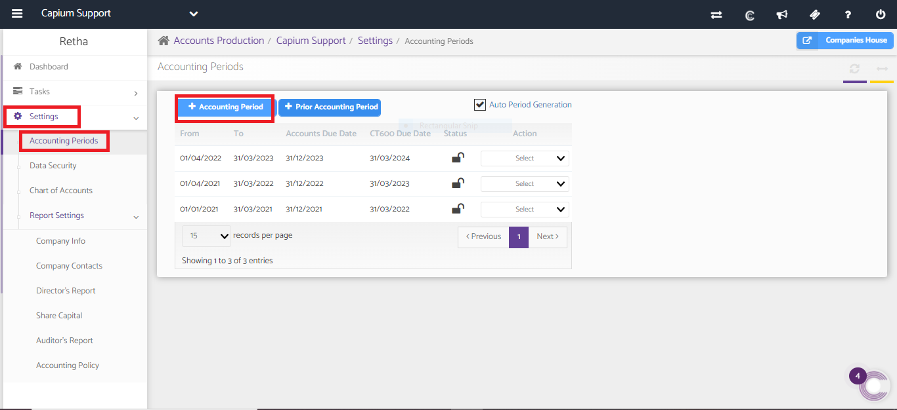

# How to create an accounting period?
	 	
			
			Print

- **Category:** Bookkeeping
- **Folder:** Bookkeeping FAQs
- **Source URL:** [https://capium.freshdesk.com/support/solutions/articles/9000165326-how-to-create-an-accounting-period-](https://capium.freshdesk.com/support/solutions/articles/9000165326-how-to-create-an-accounting-period-)
- **Article ID:** 9000165326

## Content

Solution home 
		Bookkeeping
		Bookkeeping FAQs

### How to create an accounting period?

			Print

	Modified on: Fri, 1 Mar, 2024 at 12:34 PM

		Navigation: Accounts Production >> Settings >> Accounting Periods >> ‘+’ Accounting Periods.

										Did you find it helpful?
								Yes
								No

Send feedback	Sorry we couldn't be helpful. Help us improve this article with your feedback.

## Screenshots & Diagrams (1)

