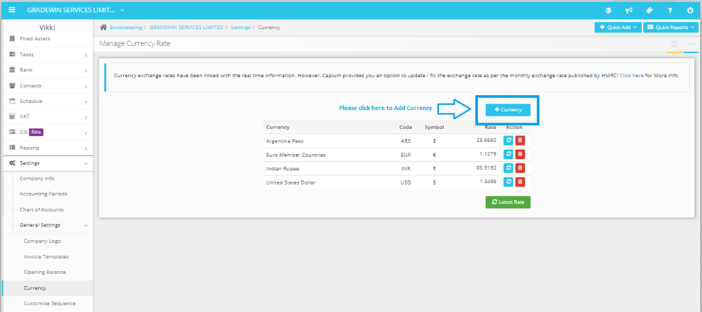

# How to deal with different currencies?
	 	
			
			Print

- **Category:** Bookkeeping
- **Folder:** Bookkeeping FAQs
- **Source URL:** [https://capium.freshdesk.com/support/solutions/articles/9000165329-how-to-deal-with-different-currencies-](https://capium.freshdesk.com/support/solutions/articles/9000165329-how-to-deal-with-different-currencies-)
- **Article ID:** 9000165329

## Content

Solution home 
		Bookkeeping
		Bookkeeping FAQs

### How to deal with different currencies?

			Print

	Modified on: Tue, 9 Nov, 2021 at  4:48 PM

		You may add multiple currencies in the Bookkeeping module at the below-provided link. Once the currencies are added, then you may choose them at Sales, Purchases, Quotations and Bank section as per the requirement.

Click here to watch a video on how to add currencies

Click here to enter a custom booked currency rate
Bookkeeping>>settings

										Did you find it helpful?
								Yes
								No

Send feedback	Sorry we couldn't be helpful. Help us improve this article with your feedback.

## Screenshots & Diagrams (1)

