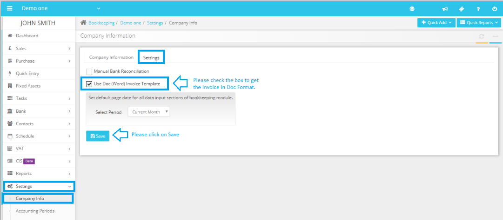

# How can I download my sales invoices in Microsoft Word format?
	 	
			
			Print

- **Category:** Bookkeeping
- **Folder:** Bookkeeping FAQs
- **Source URL:** [https://capium.freshdesk.com/support/solutions/articles/9000165331-how-can-i-download-my-sales-invoices-in-microsoft-word-format-](https://capium.freshdesk.com/support/solutions/articles/9000165331-how-can-i-download-my-sales-invoices-in-microsoft-word-format-)
- **Article ID:** 9000165331

## Content

Solution home 
		Bookkeeping
		Bookkeeping FAQs

### How can I download my sales invoices in Microsoft Word format?

			Print

	Modified on: Wed, 17 Nov, 2021 at  4:50 PM

		Navigation: Bookkeeping >> Settings >>Company Info >> Settings. 

To download the invoice in word format, you may check the box "Use Doc" under

Once it is updated you may download the invoices in both word and pdf formats. 

Please refer below screenshot for more help. 

										Did you find it helpful?
								Yes
								No

Send feedback	Sorry we couldn't be helpful. Help us improve this article with your feedback.

## Screenshots & Diagrams (1)

