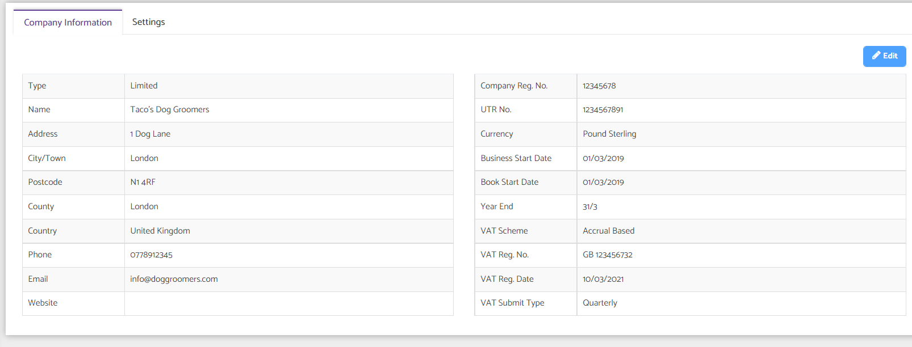

# How to input an UTR number in bookkeeping?
	 	
			
			Print

- **Category:** Bookkeeping
- **Folder:** Bookkeeping FAQs
- **Source URL:** [https://capium.freshdesk.com/support/solutions/articles/9000165332-how-to-input-an-utr-number-in-bookkeeping-](https://capium.freshdesk.com/support/solutions/articles/9000165332-how-to-input-an-utr-number-in-bookkeeping-)
- **Article ID:** 9000165332

## Content

Solution home 
		Bookkeeping
		Bookkeeping FAQs

### How to input an UTR number in bookkeeping?

			Print

	Modified on: Wed, 17 Nov, 2021 at  4:52 PM

		Navigation: Bookkeeping > Settings > Company Info

Please follow the below link to update the UTR number by clicking on the Edit button available on the top right side.

Refer to the link 

Watch here how to enter your Unique Tax Reference (UTR) Number

Click the edit button in the right hand corner. You can then adjust the UTR number.

										Did you find it helpful?
								Yes
								No

Send feedback	Sorry we couldn't be helpful. Help us improve this article with your feedback.

## Screenshots & Diagrams (1)

