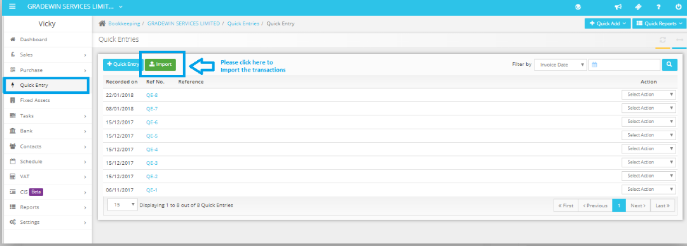
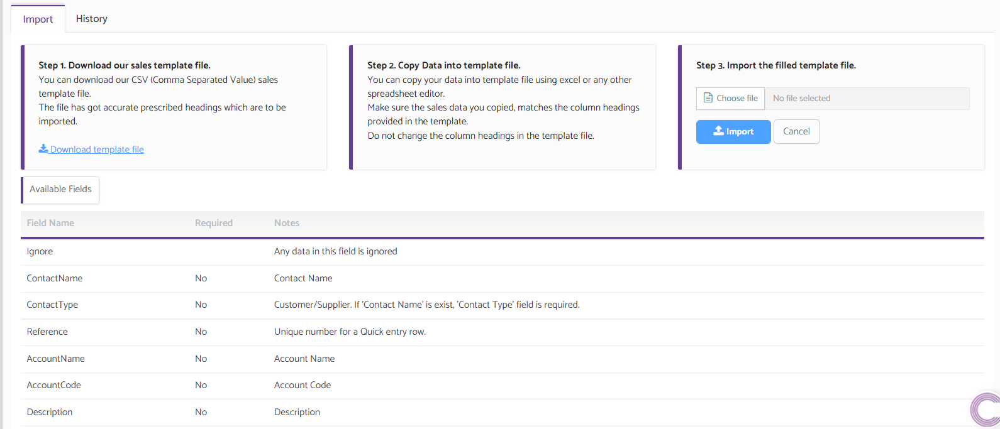

# How to upload bulk transactions in Quick Entry?
	 	
			
			Print

- **Category:** Bookkeeping
- **Folder:** Bookkeeping FAQs
- **Source URL:** [https://capium.freshdesk.com/support/solutions/articles/9000165337-how-to-upload-bulk-transactions-in-quick-entry-](https://capium.freshdesk.com/support/solutions/articles/9000165337-how-to-upload-bulk-transactions-in-quick-entry-)
- **Article ID:** 9000165337

## Content

Solution home 
		Bookkeeping
		Bookkeeping FAQs

### How to upload bulk transactions in Quick Entry?

			Print

	Modified on: Thu, 18 Nov, 2021 at  2:39 PM

		Navigation: Bookkeeping > Client > Quick Entry 

You can import the transactions in bulk via Quick Entry through a CSV file in the Bookkeeping module. You may download the template available there and can import the transactions.

Watch how to bulk import transactions here

Note: Please note that you may update the correct account codes once you import the transactions into Quick Entry.

Please click on the import button in green.

This will take you to the following page, please click download template file. A CSV will be downloaded

Please check the conditions on the page.

When finished, please save the file, then upload the chosen file and click import.

										Did you find it helpful?
								Yes
								No

Send feedback	Sorry we couldn't be helpful. Help us improve this article with your feedback.

## Screenshots & Diagrams (2)

