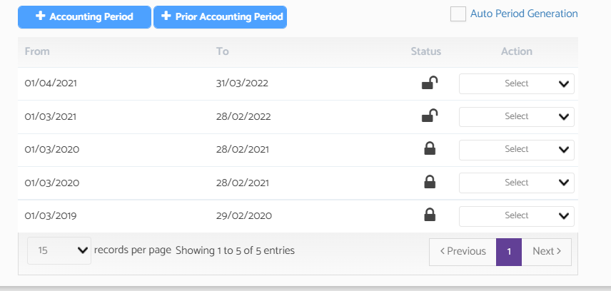

# Why am I not able to edit a journal posted?
	 	
			
			Print

- **Category:** Bookkeeping
- **Folder:** Bookkeeping FAQs
- **Source URL:** [https://capium.freshdesk.com/support/solutions/articles/9000165346-why-am-i-not-able-to-edit-a-journal-posted-](https://capium.freshdesk.com/support/solutions/articles/9000165346-why-am-i-not-able-to-edit-a-journal-posted-)
- **Article ID:** 9000165346

## Content

Solution home 
		Bookkeeping
		Bookkeeping FAQs

### Why am I not able to edit a journal posted?

			Print

	Modified on: Thu, 25 Nov, 2021 at 11:48 AM

		This generally happens when the journal is included in the VAT return or the accounting period is locked for that period. 

To unlock a journal please navigate to 

Bookkeeping > Select Client > Settings > Accounting Periods

Then please click on action dropdown, and select unlock period.

										Did you find it helpful?
								Yes
								No

Send feedback	Sorry we couldn't be helpful. Help us improve this article with your feedback.

## Screenshots & Diagrams (1)

