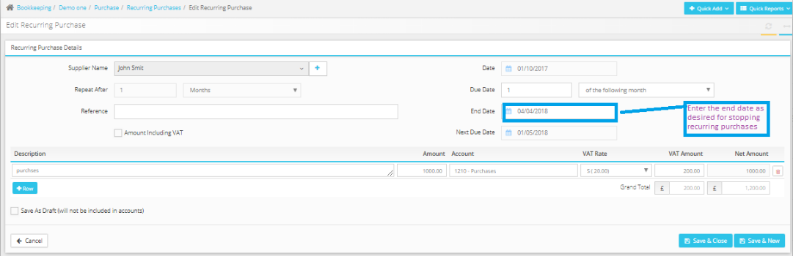

# How to stop recurring payments?
	 	
			
			Print

- **Category:** Bookkeeping
- **Folder:** Bookkeeping FAQs
- **Source URL:** [https://capium.freshdesk.com/support/solutions/articles/9000165355-how-to-stop-recurring-payments-](https://capium.freshdesk.com/support/solutions/articles/9000165355-how-to-stop-recurring-payments-)
- **Article ID:** 9000165355

## Content

Solution home 
		Bookkeeping
		Bookkeeping FAQs

### How to stop recurring payments?

			Print

	Modified on: Thu, 25 Nov, 2021 at 11:55 AM

		 Navigation: Bookkeeping> Select Client >Purchases >Recurring

You may stop the recurring purchases by navigating to Purchases and enter the end date by clicking on the edit option available under Action drop-down.

Click here to watch how to stop recurring purchases
Please refer below screenshot for more help.

										Did you find it helpful?
								Yes
								No

Send feedback	Sorry we couldn't be helpful. Help us improve this article with your feedback.

## Screenshots & Diagrams (1)

