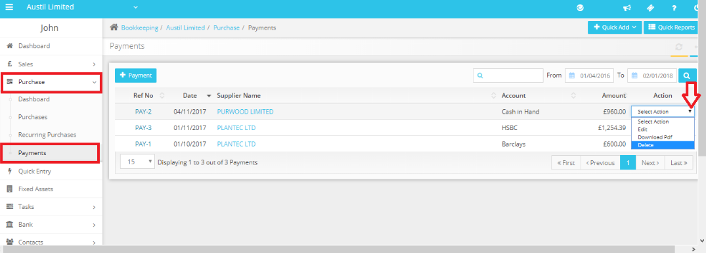

# How to delete an Advance Payment?
	 	
			
			Print

- **Category:** Bookkeeping
- **Folder:** Bookkeeping FAQs
- **Source URL:** [https://capium.freshdesk.com/support/solutions/articles/9000165361-how-to-delete-an-advance-payment-](https://capium.freshdesk.com/support/solutions/articles/9000165361-how-to-delete-an-advance-payment-)
- **Article ID:** 9000165361

## Content

Solution home 
		Bookkeeping
		Bookkeeping FAQs

### How to delete an Advance Payment?

			Print

	Modified on: Thu, 25 Nov, 2021 at 12:53 PM

		Navigation: Bookkeeping > Select Client > Purchases > Payments

You may simply delete the advance payment by using the delete option under Action drop-down box.

Please refer below screenshot for more help.

										Did you find it helpful?
								Yes
								No

Send feedback	Sorry we couldn't be helpful. Help us improve this article with your feedback.

## Screenshots & Diagrams (1)

