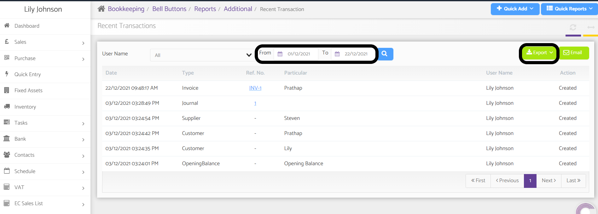

# How to track the information of Journal posted?
	 	
			
			Print

- **Category:** Bookkeeping
- **Folder:** Bookkeeping FAQs
- **Source URL:** [https://capium.freshdesk.com/support/solutions/articles/9000165364-how-to-track-the-information-of-journal-posted-](https://capium.freshdesk.com/support/solutions/articles/9000165364-how-to-track-the-information-of-journal-posted-)
- **Article ID:** 9000165364

## Content

Solution home 
		Bookkeeping
		Bookkeeping FAQs

### How to track the information of Journal posted?

			Print

	Modified on: Wed, 22 Dec, 2021 at  4:31 PM

		Navigation:  Bookkeeping > Client > Reports > Additional > Recent Transaction

From here you will find the list of recent transactions. 

It will show you the Day date and Time and the username by whom the transaction was posted.

This can be exported to PDF or CSV using the export button.

Refer to the link 

Here's a video on how to track transactions

Here's a video on how to track all transactions

										Did you find it helpful?
								Yes
								No

Send feedback	Sorry we couldn't be helpful. Help us improve this article with your feedback.

## Screenshots & Diagrams (1)

