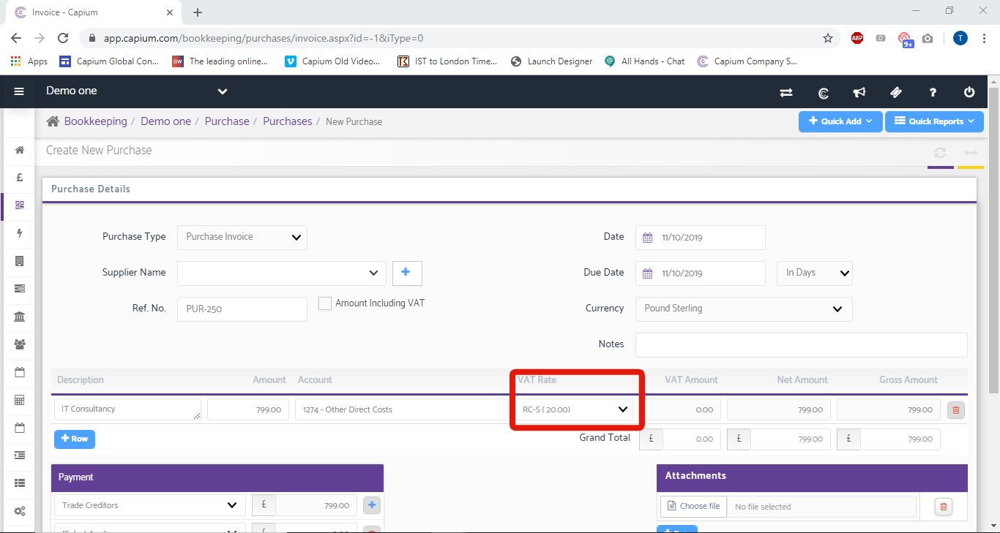

# How do I create VAT Reverse charges?
	 	
			
			Print

- **Category:** Bookkeeping
- **Folder:** Bookkeeping FAQs
- **Source URL:** [https://capium.freshdesk.com/support/solutions/articles/9000176372-how-do-i-create-vat-reverse-charges-](https://capium.freshdesk.com/support/solutions/articles/9000176372-how-do-i-create-vat-reverse-charges-)
- **Article ID:** 9000176372

## Content

Solution home 
		Bookkeeping
		Bookkeeping FAQs

### How do I create VAT Reverse charges?

			Print

	Modified on: Thu, 16 Sep, 2021 at 11:42 AM

		Navigation: Bookkeeping > Select Client > Sales  (or Purchases) > Invoices (or Purchases)

Click here to watch how to use VAT reverse charge

Help/Guide:

Please head into the client you would like to add the reverse charge for, and enter either sales or puchases.

Click on Invoices/Purchases and '+ new invoice'

When creating a Purchase or Sales invoice, to add the Reverse Charge (20%) VAT click the dropdown button shown below. The rate is abbreviated as RC-S (20) as well as Reduced and Zero Rate.

The VAT is calculated at the UK standard rate on an original purchase and cost is included in the output VAT (sales VAT) (Box 1 in VAT summary) as if it is sold to UK customers. Additionally, the original purchase cost will be included in net sales.

If the purchases are Reduced rated, the input VAT is calculated based on the reduced rate, and is then included in box 1 and the net sales included in box 6.

Note – this 9-box logic is also applicable under MTD and not just standard VAT

										Did you find it helpful?
								Yes
								No

Send feedback	Sorry we couldn't be helpful. Help us improve this article with your feedback.

## Screenshots & Diagrams (1)

