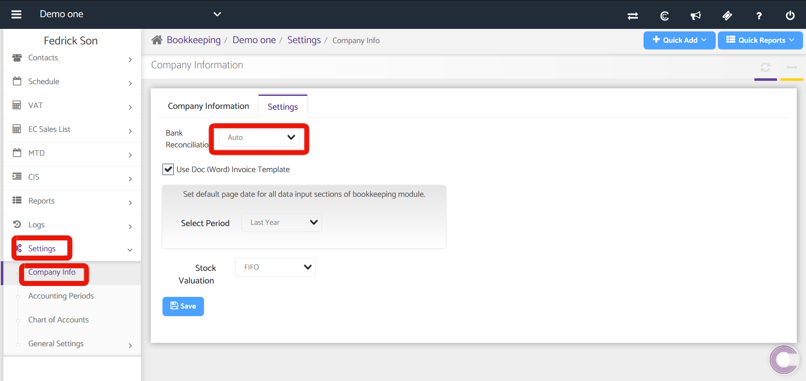
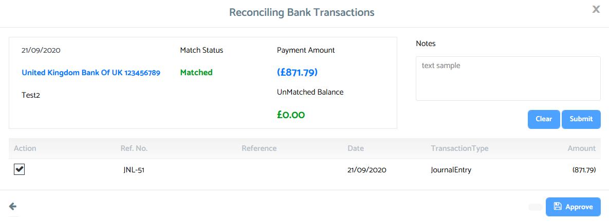
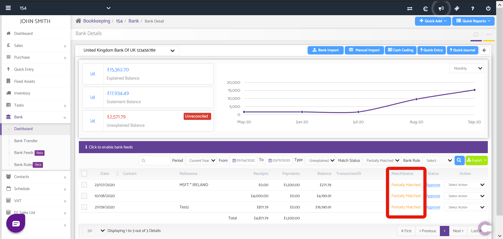
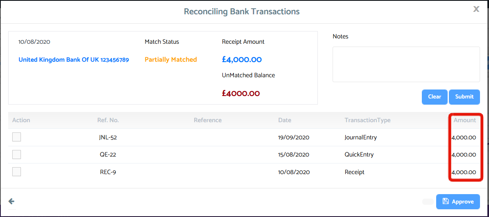
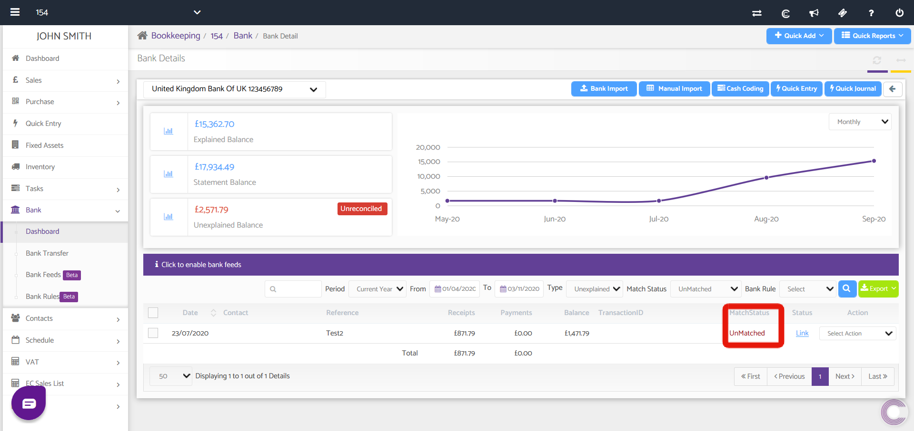
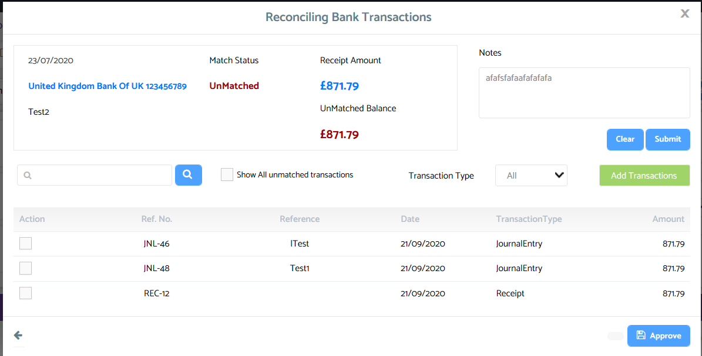
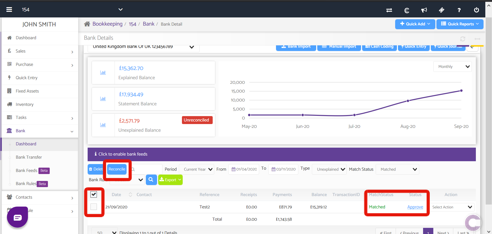

# Auto Bank Reconciliation
	 	
			
			Print

- **Category:** Bookkeeping
- **Folder:** Bookkeeping Help Guide
- **Source URL:** [https://capium.freshdesk.com/support/solutions/articles/9000195198-auto-bank-reconciliation](https://capium.freshdesk.com/support/solutions/articles/9000195198-auto-bank-reconciliation)
- **Article ID:** 9000195198

## Content

Solution home 
		Bookkeeping
		Bookkeeping Help Guide

### Auto Bank Reconciliation

			Print

	Modified on: Tue, 3 Nov, 2020 at  3:44 PM

		Navigation: Bookkeeping > Select Client > Settings > Company Info > Settings > Bank Reconciliation set to Auto 

Quick navigation link

Help Guide

The objective of Auto Bank Reconciliation is to automate the process of reconciling by matching matching bank transactions to statements recorded in Bookkeeping (Receipts, Payments, Quick Entry etc.)

To begin, head to the navigation to enable Auto Bank Reconciliation.

Upon activating Auto as per the above screenshot, the system will create three principles for reconciling transactions:

1. Matched Transactions

2. Partially Matched Transactions

3. Unmatched Transactions

Matched: Here, either a receipt, payment, journal entry or quick entry matches a bank transaction with the same amount and same date of transaction.

To explain matched transactions, click the Approve text next to the 'Matched' status, where an interface to reconcile the transaction will popup. Simply tick the checkbox next to the transaction to confirm the transaction displayed is correct, then approve.

Partially Matched: Here, there are multiple records of either receipts, payments, journal entries or quick entry transactions with matching amounts as a single bank transaction. 

To explain Partially Matched transactions, click the Approve button next to the Partially Matched status where the bank reconciliation interface will popup as shown below. There, select the entry out of the list which exactly matches the bank transaction then approve

Unmatched: Here, there are no entries from receipts, payments, journals or quick entries that match the particular bank transaction with regard to date of entry and/or matching amount. 

In this case, you will need to 'Link' that bank transaction to one of the possible aforementioned entries, to do so, click the Link button next to the Unmatched status. You will then need to choose one of the listed entries to match with the bank transaction. However if there isn't an entry, use the green 'Add Transactions' button to do so, where you will be then able to add a Direct Receipt or Payment, a Receipt/Payment to the Customer/Supplier account, a new Invoice/Purchase or multiple transactions.

Approved Transactions
Once the transactions are approved and matched, use the checkbox as shown below to bulk reconcile or 'explain'

Click here to watch how to setup and use Auto Bank Reconciliation

Click here to watch how to setup and use Auto Bank Reconciliation

										Did you find it helpful?
								Yes
								No

Send feedback	Sorry we couldn't be helpful. Help us improve this article with your feedback.

## Screenshots & Diagrams (8)

