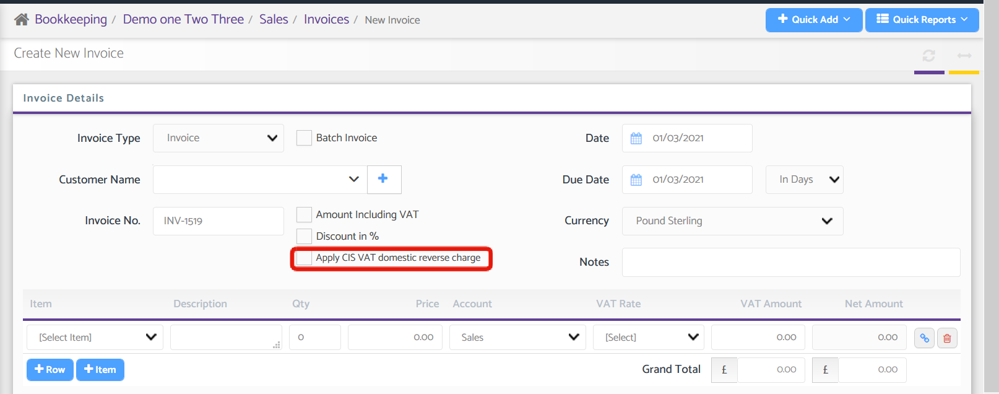
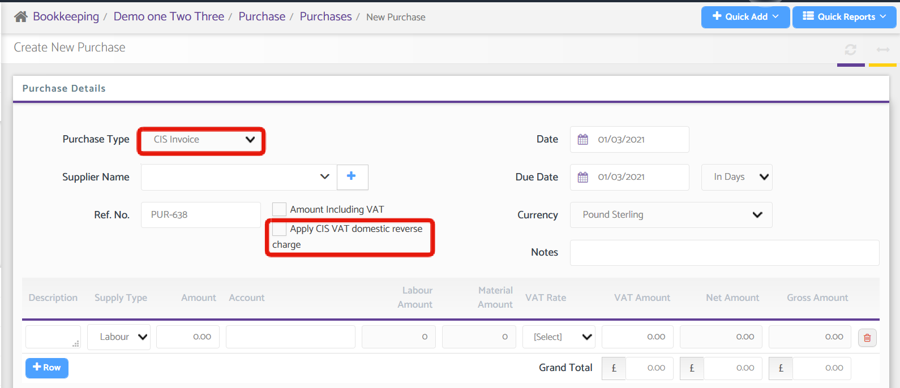

# Domestic Reverse Charge - CIS
	 	
			
			Print

- **Category:** Bookkeeping
- **Folder:** Bookkeeping Help Guide
- **Source URL:** [https://capium.freshdesk.com/support/solutions/articles/9000199378-domestic-reverse-charge-cis](https://capium.freshdesk.com/support/solutions/articles/9000199378-domestic-reverse-charge-cis)
- **Article ID:** 9000199378

## Content

Solution home 
		Bookkeeping
		Bookkeeping Help Guide

### Domestic Reverse Charge - CIS

			Print

	Modified on: Mon, 1 Mar, 2021 at 12:25 PM

		The Construction Industry Scheme (CIS) VAT reverse charge applies to construction services from 1 March 2021.

This is when the reverse charge applies the customer accounts for the supplier's output VAT. This measure only applies to construction supplies made by a business to business.

Key conditions  Domestic Reverse Charge under CIS is applied when the following conditions are met:

1) The supply for VAT consists of construction services and materials.

2) It is made at a standard or reduced-rate of VAT.

3) Between a UK VAT registered supplier and UK VAT registered customer.

4) Supplier and customer are registered for CIS.

5) The customer intends to make an ongoing supply of construction services to another party.

6) The supplier and customer are not connected.

Note:

The use of the VAT Flat Rate Scheme and Cash accounting may not be possible.

Help Guide

Navigate to: Bookkeeping > Select a Client > Sales/Purchase > Invoices/Purchases

Sales Invoice

When creating a new Sales Invoice, you will have the option to 'Apply CIS VAT Domestic Reverse Charge'. 

Upon selecting that option, two VAT rates will be available to use; Standard rate (20%) & Reduced rate (5%). Here, you can create an invoice with multiple items using the two VAT rates.

Effect of CIS Reverse Charge for Sales Invoice in VAT return:

The net sale value will be reflected in Box-6 of VAT return.

Purchase Invoice

When creating a new Purchase Invoice, select CIS Invoice from the 'Purchase Type' drop-down menu, to which you will then have the option to 'Apply CIS VAT Domestic Reverse Charge'. 

Once the above checkbox is ticked, there will be two VAT Rates available to use; Standard rate (20%) & Reduced rate (5%). Here, you can create a Purchase Invoice with multiple items using the two VAT rates.

Effect of CIS reverse charge for purchase invoice in VAT return:

1. The VAT amount to be shown in Box-1 & Box-4.

2. The Net Purchase Value will be shown in Box-7

Click here to watch how to use Domestic Reverse Charge for CIS 

										Did you find it helpful?
								Yes
								No

Send feedback	Sorry we couldn't be helpful. Help us improve this article with your feedback.

## Screenshots & Diagrams (2)

