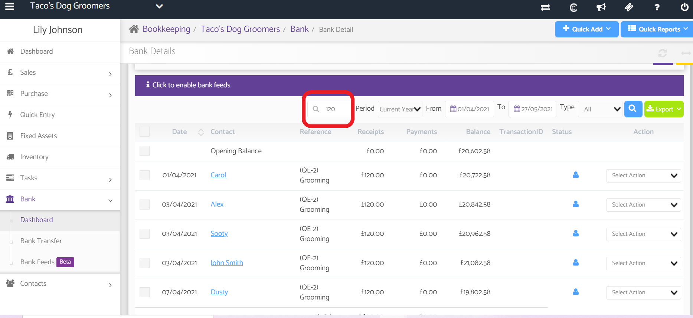

# Bank Account Search Tool
	 	
			
			Print

- **Category:** Bookkeeping
- **Folder:** Bookkeeping Help Guide
- **Source URL:** [https://capium.freshdesk.com/support/solutions/articles/9000202684-bank-account-search-tool](https://capium.freshdesk.com/support/solutions/articles/9000202684-bank-account-search-tool)
- **Article ID:** 9000202684

## Content

Solution home 
		Bookkeeping
		Bookkeeping Help Guide

### Bank Account Search Tool

			Print

	Modified on: Thu, 27 May, 2021 at 11:02 AM

		Click here to watch how to search for specific transactions in bank accounts

My Admin Navigation: Bookkeeping > Select Client > Bank > Dashboard > Select Bank Account 

Help/Guide

You can now search for specific amounts in your bank accounts in Capium Bookkeeping

Please use the search tool circled below to search for a specific amount and press the blue search tool button

										Did you find it helpful?
								Yes
								No

Send feedback	Sorry we couldn't be helpful. Help us improve this article with your feedback.

## Screenshots & Diagrams (1)

