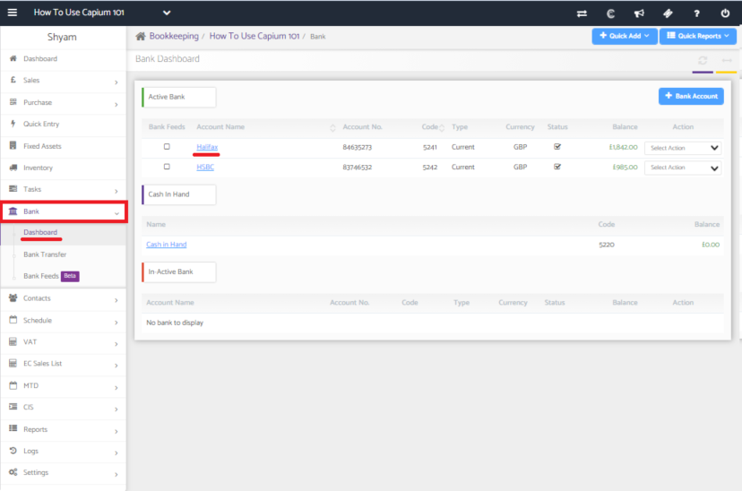
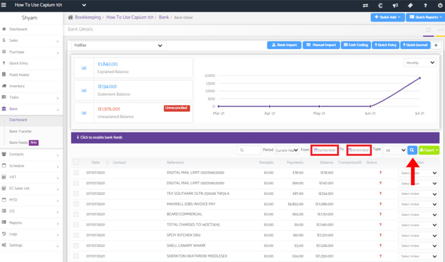
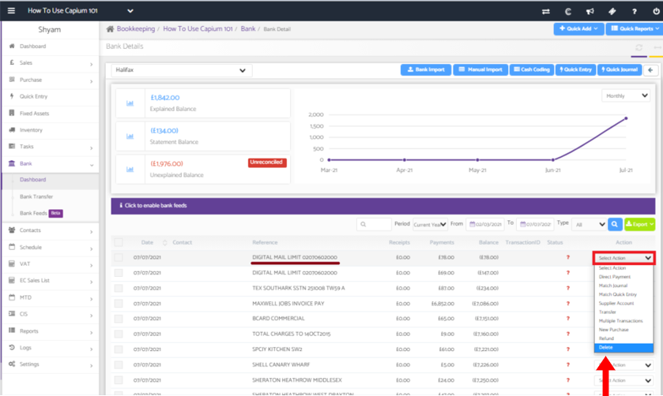

# How to delete a bank transaction
	 	
			
			Print

- **Category:** Bookkeeping
- **Folder:** Bookkeeping Help Guide
- **Source URL:** [https://capium.freshdesk.com/support/solutions/articles/9000204223-how-to-delete-a-bank-transaction](https://capium.freshdesk.com/support/solutions/articles/9000204223-how-to-delete-a-bank-transaction)
- **Article ID:** 9000204223

## Content

Solution home 
		Bookkeeping
		Bookkeeping Help Guide

### How to delete a bank transaction

			Print

	Modified on: Wed, 7 Jul, 2021 at  5:03 PM

		Location 

Client bookkeeping dashboard >> Bank >> Dashboard >> Select the back account from which the transaction needs to be deleted >> Find the transaction >> Select Action >> Delete

Video Tutorial

Click here to watch how to delete a bank transaction

Help Guide

Navigating to your bank account

From the client dashboard, use the navigation panel on the left hand side of the screen to go into Bank >> Dashboard. 

You should see all of the bank accounts you have created.

Click on the bank account which has the transaction which needs to be deleted.

Deleting the bank transaction

To search for the transaction that needs to be deleted, enter the date of the transaction and click search.

Identify the transaction and then click on 'Select action'.

Click on 'Delete' to remove the transaction.

										Did you find it helpful?
								Yes
								No

Send feedback	Sorry we couldn't be helpful. Help us improve this article with your feedback.

## Screenshots & Diagrams (3)

