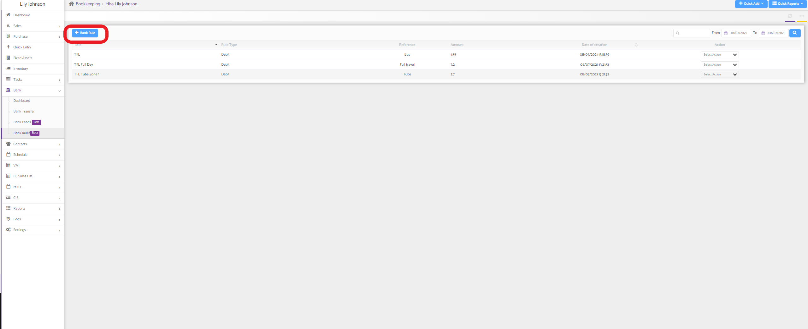
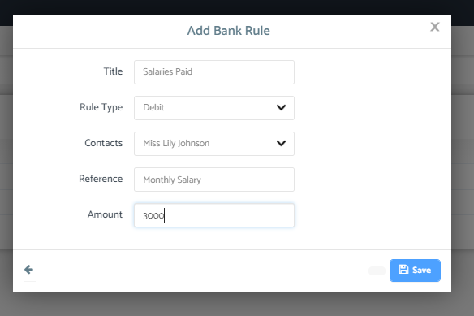
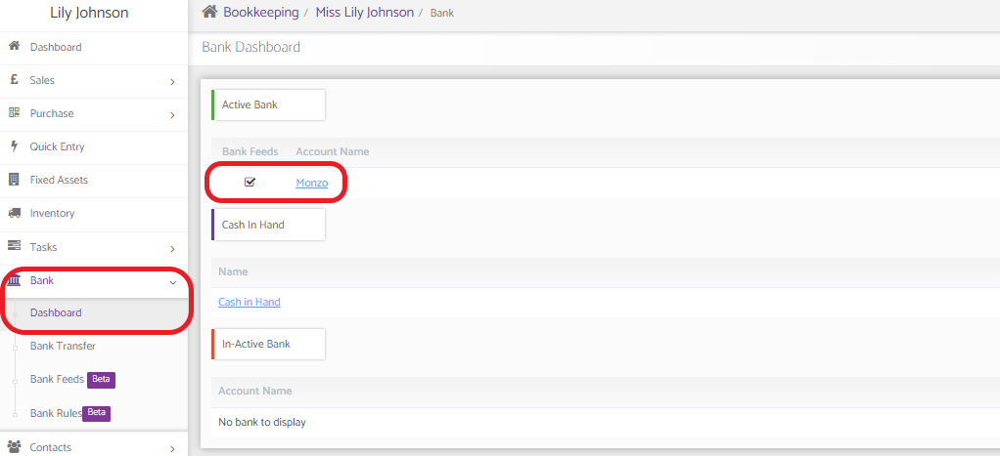
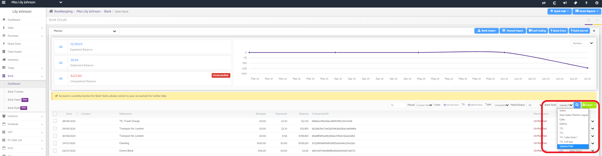

# How to Create Bank Rules
	 	
			
			Print

- **Category:** Bookkeeping
- **Folder:** Bookkeeping Help Guide
- **Source URL:** [https://capium.freshdesk.com/support/solutions/articles/9000204283-how-to-create-bank-rules](https://capium.freshdesk.com/support/solutions/articles/9000204283-how-to-create-bank-rules)
- **Article ID:** 9000204283

## Content

Solution home 
		Bookkeeping
		Bookkeeping Help Guide

### How to Create Bank Rules

			Print

	Modified on: Thu, 8 Jul, 2021 at  3:34 PM

		Navigation: Bookkeeping > Select Client > Bank > Bank Rules > 

Help Guide

Bank rules can help reconcile auto transactions, firstly bank feeds do need to be set up

Please click here to find out more about bank feeds

Please head to bank rules under the bank tab on the menu

Then click on + Bank Rule as highlighted below

A pop up will appear. please enter in the information as needed, then click save.

Once saved, please click on Bank > Dashboard > Select Bank Account

Once in the bank account you can use the dropdown in the right hand side titled Bank Rules to select your created bank rule

One the blue search button is clicked, the bank rule will search through the transactions to find transactions relating to the rule.

										Did you find it helpful?
								Yes
								No

Send feedback	Sorry we couldn't be helpful. Help us improve this article with your feedback.

## Screenshots & Diagrams (4)

