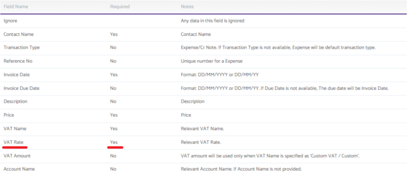
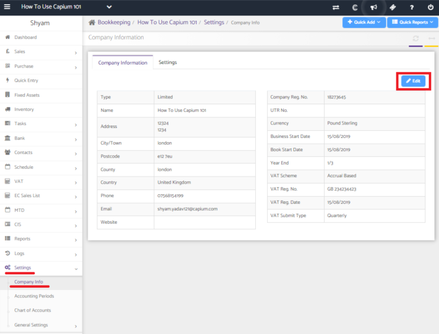
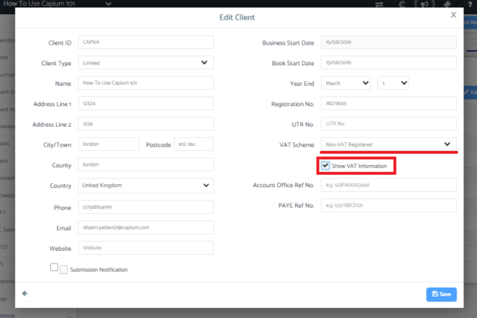

# How to do a bulk sales/purchase import with &#39;No VAT&#39;
	 	
			
			Print

- **Category:** Bookkeeping
- **Folder:** Bookkeeping FAQs
- **Source URL:** [https://capium.freshdesk.com/support/solutions/articles/9000204508-how-to-do-a-bulk-sales-purchase-import-with-no-vat-](https://capium.freshdesk.com/support/solutions/articles/9000204508-how-to-do-a-bulk-sales-purchase-import-with-no-vat-)
- **Article ID:** 9000204508

## Content

Solution home 
		Bookkeeping
		Bookkeeping FAQs

### How to do a bulk sales/purchase import with &#39;No VAT&#39;

			Print

	Modified on: Tue, 20 Jul, 2021 at  5:16 PM

		Location: 

Client Bookkeeping dashboard >> Settings >> Company Info >> Edit >> Ensure that the VAT Scheme has been set as 'Not VAT Registered' >> Click on the box next to 'Show VAT Information' 

Video Tutorial: 

Click here to watch how to do a bulk sales/purchase import with 'No VAT'

Help Guide:

When doing a bulk upload of sales or purchase invoices, you will see that the VAT rate is a mandatory field.

If the company you are working with is not VAT registered, you can follow these steps to allow the import to accept transactions that have 'No VAT'.

Go into the 'Settings' section from the navigation panel and then click on 'Company Info'. From there click on the 'Edit' button.

Ensure that the VAT scheme is set to 'Non-VAT Registered' and then click on the box next to 'Show VAT Information'.

You will then be able to continue with your invoice upload whilst having transactions that have 'No VAT'. 

										Did you find it helpful?
								Yes
								No

Send feedback	Sorry we couldn't be helpful. Help us improve this article with your feedback.

## Screenshots & Diagrams (3)

