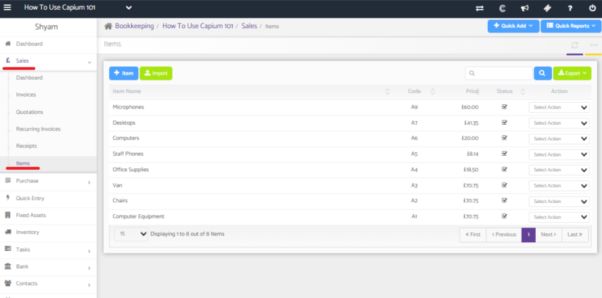
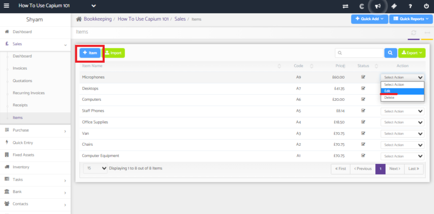
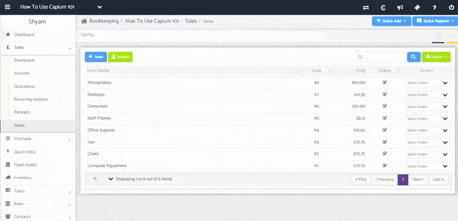
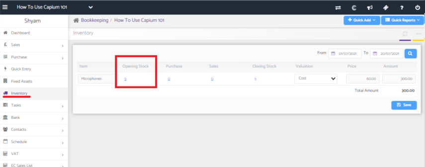
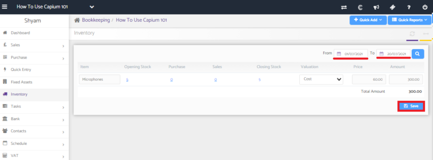
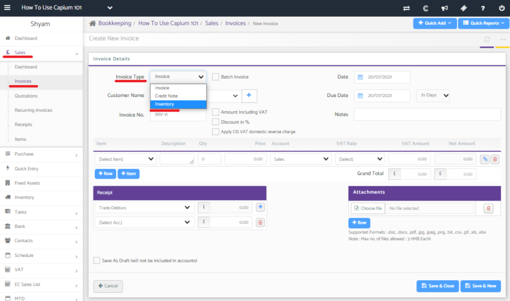
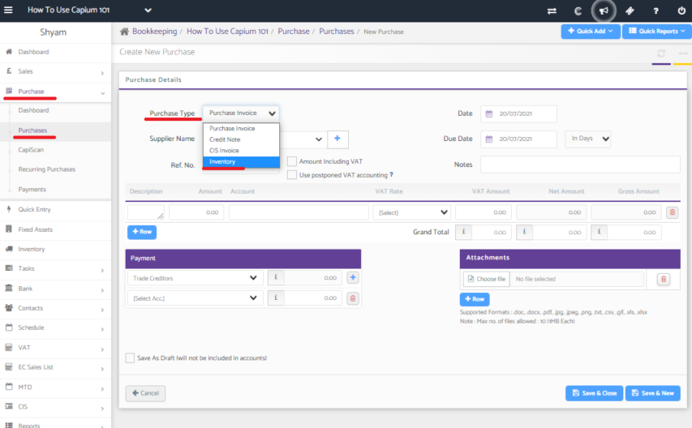

# How to manage opening and closing stock
	 	
			
			Print

- **Category:** Bookkeeping
- **Folder:** Bookkeeping FAQs
- **Source URL:** [https://capium.freshdesk.com/support/solutions/articles/9000204640-how-to-manage-opening-and-closing-stock](https://capium.freshdesk.com/support/solutions/articles/9000204640-how-to-manage-opening-and-closing-stock)
- **Article ID:** 9000204640

## Content

Solution home 
		Bookkeeping
		Bookkeeping FAQs

### How to manage opening and closing stock

			Print

	Modified on: Tue, 20 Jul, 2021 at  4:41 PM

		Location:

Opening stock:

Sales >> Items >> Create new item >> Update the fields next to 'Opening Balance Quantity' and the 'Opening Balance Price' 

Closing stock:

Inventory >> search for the accounting period >> Click on the search button >> Click on 'Save'

Video Tutorial: 

Click here to watch how to manage the opening and closing stock

Help Guide:

Setting the opening stock value

Go into 'Sales' and then 'Items'.

You can either create a new item or edit an item that has already been created.

In the item menu, you will be able to set a value for the 'Opening Balance Quantity' and the 'Opening Balance Price'.

Going into the Inventory section, you'll see the the Opening Stock has been updated.

Setting the closing stock value

Using the search function, search for the accounting period and then save. This will automatically calculate the closing stock based on the invoices created for that period. 

Changing the inventory amount

To decrease the inventory, create a sales invoice and change the invoice type to 'Inventory'.

To increase the inventory, create a purchase invoice and change the invoice type to 'Inventory'. 

										Did you find it helpful?
								Yes
								No

Send feedback	Sorry we couldn't be helpful. Help us improve this article with your feedback.

## Screenshots & Diagrams (7)

