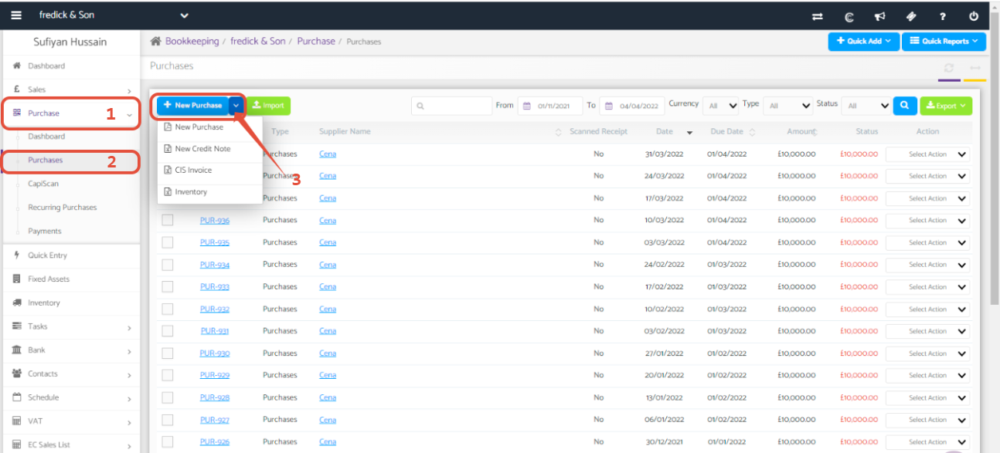
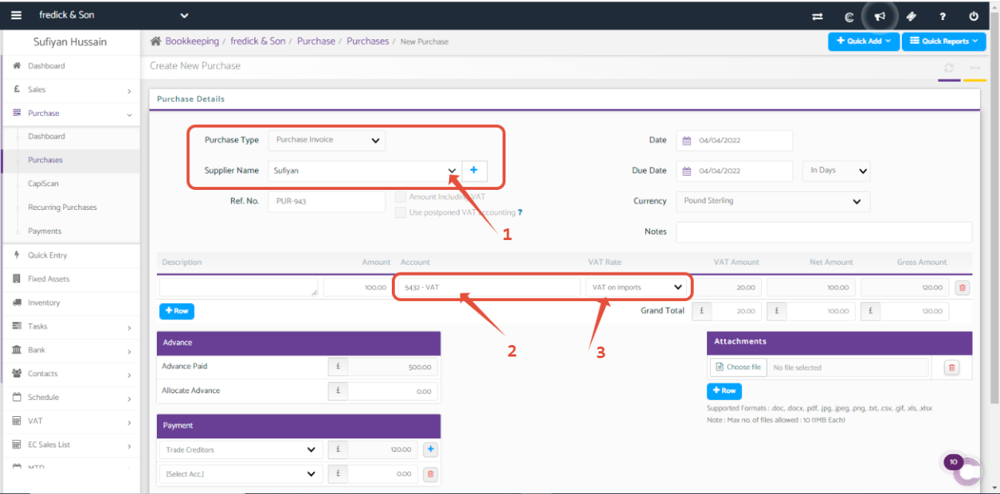
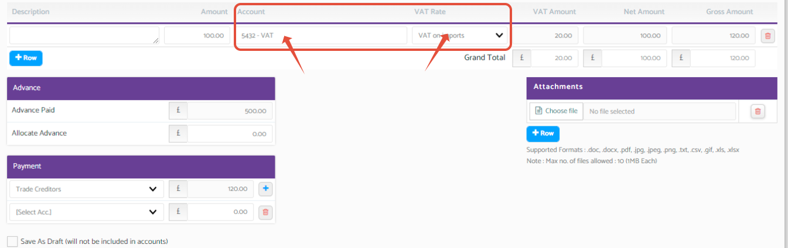
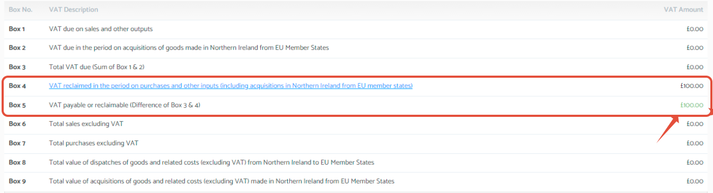

# How to update Import VAT (C79)
	 	
			
			Print

- **Category:** Bookkeeping
- **Folder:** Bookkeeping FAQs
- **Source URL:** [https://capium.freshdesk.com/support/solutions/articles/9000213722-how-to-update-import-vat-c79-](https://capium.freshdesk.com/support/solutions/articles/9000213722-how-to-update-import-vat-c79-)
- **Article ID:** 9000213722

## Content

Solution home 
		Bookkeeping
		Bookkeeping FAQs

### How to update Import VAT (C79)

			Print

	Modified on: Mon, 4 Apr, 2022 at  5:34 PM

Navigation:

Bookkeeping Module >> Select a client >> Purchases >> New Purchase >>Select Account >> VAT 5432 >> VAT Rate >> Select >> VAT on Import.

Step 1: 

To go on the new purchase invoice tab alternatively, Click Here to be redirected to the page. 

Step 2:

Once the above step is completed, you will be redirected to the invoice page which looks as below. 

On this page, once you start by filling out the invoice details. 

Step 3:

Now it is just the matter if selecting (5432 VAT) under the account and selecting (VAT on imports) under the VAT Rate. 

Step 4: 

These changes will now be shown under your VAT Return in Box 4 and Box 5.

										Did you find it helpful?
								Yes
								No

Send feedback	Sorry we couldn't be helpful. Help us improve this article with your feedback.

## Screenshots & Diagrams (4)

