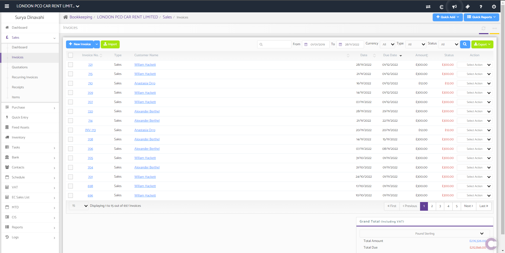
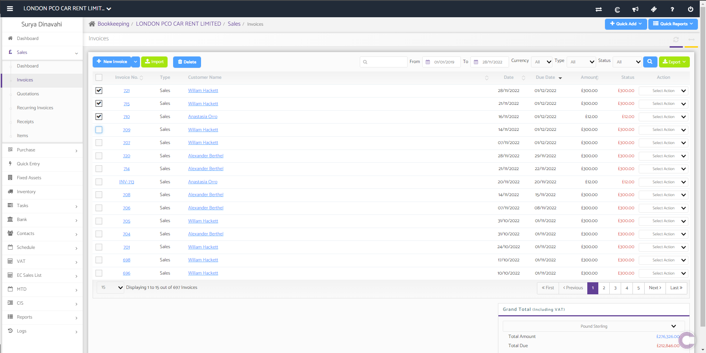
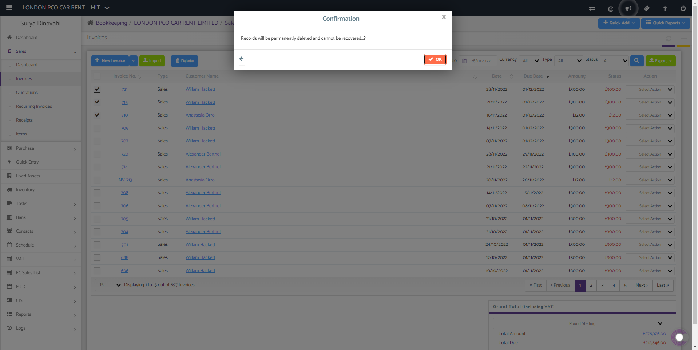

# Bulk Delete Transactions (Sales, Purchases &amp; Journals)
	 	
			
			Print

- **Category:** Bookkeeping
- **Folder:** Bookkeeping Help Guide
- **Source URL:** [https://capium.freshdesk.com/support/solutions/articles/9000221938-bulk-delete-transactions-sales-purchases-journals-](https://capium.freshdesk.com/support/solutions/articles/9000221938-bulk-delete-transactions-sales-purchases-journals-)
- **Article ID:** 9000221938

## Content

Solution home 
		Bookkeeping
		Bookkeeping Help Guide

### Bulk Delete Transactions (Sales, Purchases & Journals)

			Print

	Modified on: Thu, 6 Apr, 2023 at  8:15 AM

		To bulk delete transactions you can click on this link. Alternatively you can also follow the navigation as shown below.

Navigation: Bookkeeping > Client Specific > Sales / Purchases

                     Bookkeeping > Client Specific > Tasks > Journals

Click here to view video

Once you have followed the navigation, select the checkboxes for the transactions you would like to delete and a 'Delete' button will appear. 

Select 'Delete' and the following prompt will appear. 

Confirm you would like to delete the transactions by selecting 'Ok'. 

The same process is required to delete transactions from purchases and journals too.

										Did you find it helpful?
								Yes
								No

Send feedback	Sorry we couldn't be helpful. Help us improve this article with your feedback.

## Screenshots & Diagrams (3)

