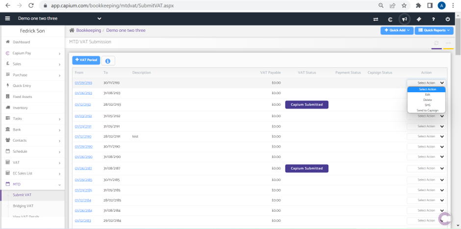
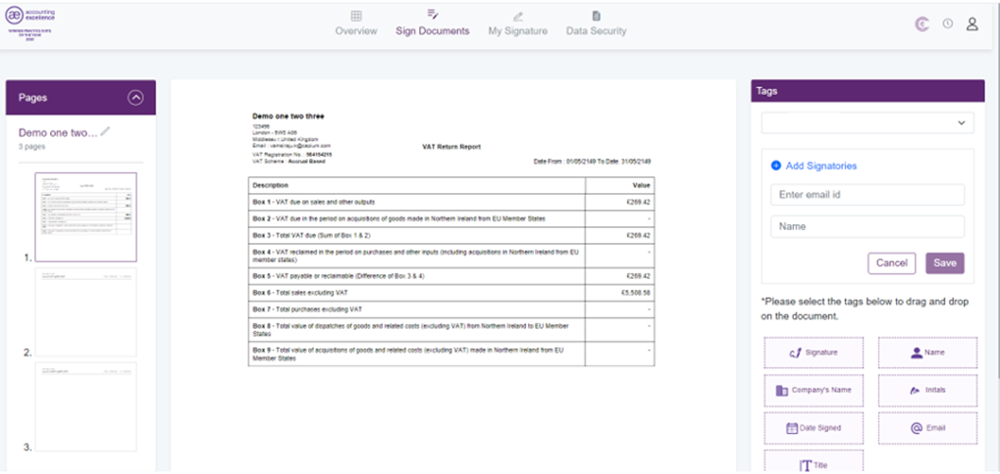

# How to send VAT Audit Report to Capisign?
	 	
			
			Print

- **Category:** Bookkeeping
- **Folder:** Bookkeeping Help Guide
- **Source URL:** [https://capium.freshdesk.com/support/solutions/articles/9000227162-how-to-send-vat-audit-report-to-capisign-](https://capium.freshdesk.com/support/solutions/articles/9000227162-how-to-send-vat-audit-report-to-capisign-)
- **Article ID:** 9000227162

## Content

Solution home 
		Bookkeeping
		Bookkeeping Help Guide

### How to send VAT Audit Report to Capisign?

			Print

	Modified on: Tue, 2 May, 2023 at 12:28 PM

		To send VAT Audit Report from Bookkeeping to Capisign.

Navigation: Bookkeeping > Selected Client > MTD > Submit VAT

Following the navigation process, a user is able to send a VAT Audit Report to a client using the drop-down menu and selecting the 'Send to Capisign' option. 

Once it has been done, a user will be redirected to a Capisign module and will be required to add signatories, drag across relevant tags, review the document and send it to a client.

										Did you find it helpful?
								Yes
								No

Send feedback	Sorry we couldn't be helpful. Help us improve this article with your feedback.

## Screenshots & Diagrams (2)

