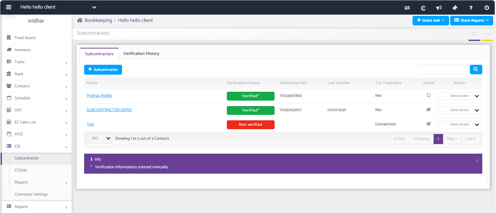
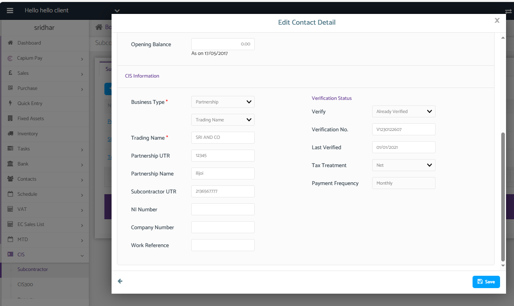
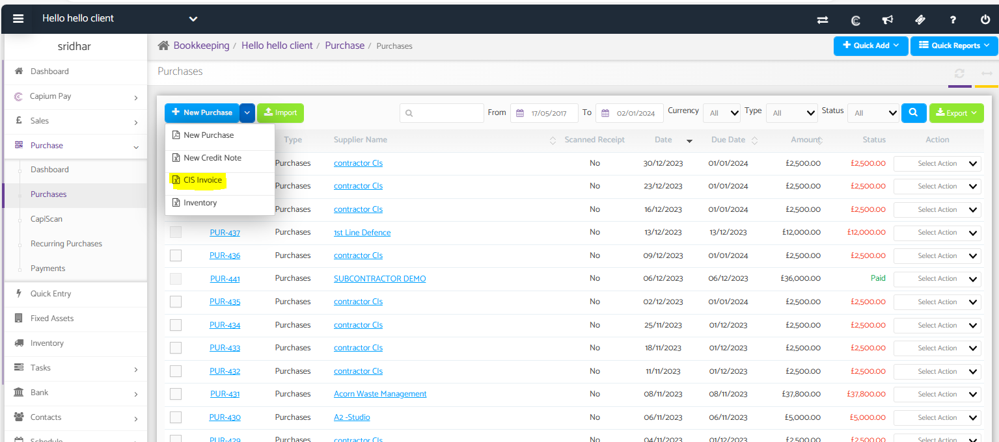
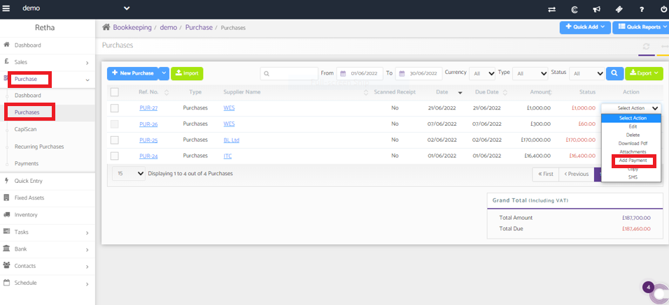
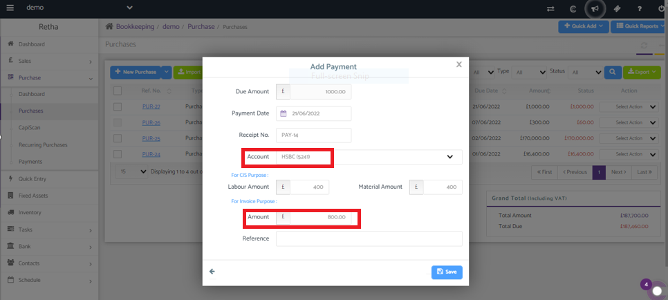
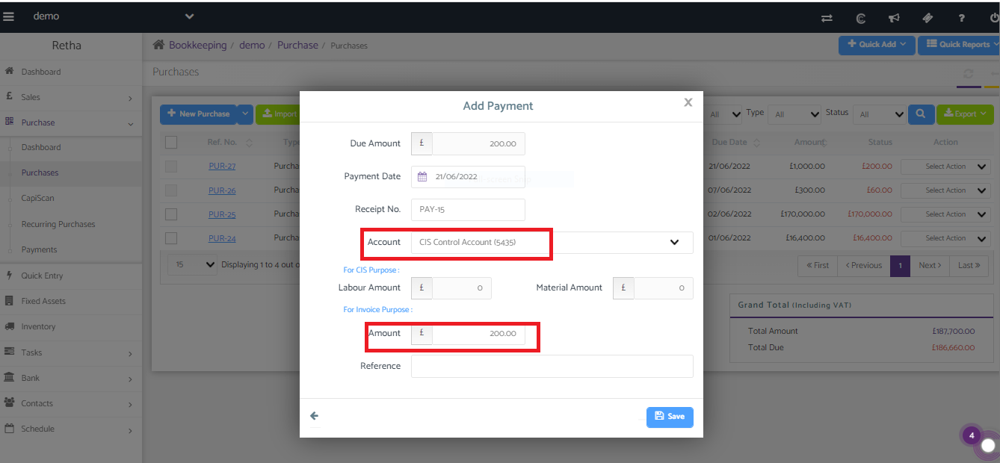
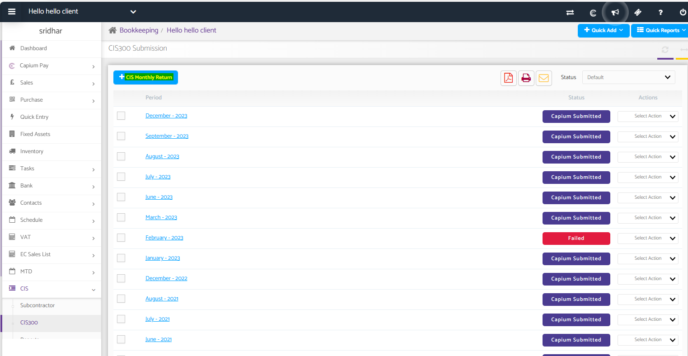
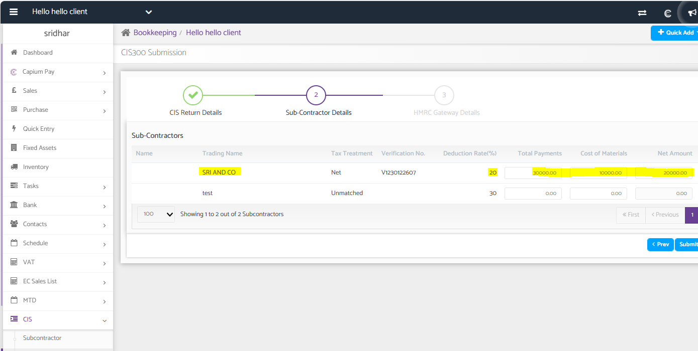

# CIS Process
	 	
			
			Print

- **Category:** Bookkeeping
- **Folder:** Bookkeeping Help Guide
- **Source URL:** [https://capium.freshdesk.com/support/solutions/articles/9000236616-cis-process](https://capium.freshdesk.com/support/solutions/articles/9000236616-cis-process)
- **Article ID:** 9000236616

## Content

Solution home 
		Bookkeeping
		Bookkeeping Help Guide

### CIS Process

			Print

	Modified on: Fri, 1 Mar, 2024 at  3:46 PM

		Navigation: Bookkeeping >> Select Client >> CIS >> Subcontractor 

Before raising a CIS invoice, you need to add the supplier i.e the CIS subcontractor details and the verification details to get the accurate amount of % displayed while submitting the CIS-300 as shown below.

After adding the details, you need to use the `CIS invoice` section to generate new purchases

Navigation: Bookkeeping>> Purchase >> add a new purchase invoice, and select the type as 'CIS invoice' 

Adding payments for CIS Invoice

For adding payments for CIS invoices you can navigate to:

Bookkeeping >>Purchase>>Purchases>>Select the particular CIS invoice >> from the action drop-down "ADD PAYMENT".

While Adding payment for CIS invoice, 20% or 30% as per applicable rate the amount of CIS deduction amount need to be transferred to CIS Control account and remaining amount need to be paid from Cash (or) bank account.

(1) For payment made to CIS invoice you may please navigate to: 

Bookkeeping>>Purchase>>Purchases>>Select the particular CIS invoice>> from the action drop-down "add payment".

(2) For transferring the amount to CIS deduction account you may please navigate to:

Bookkeeping>>Purchase>>Purchases>>Select the particular CIS invoice>> from the action drop-down "add payment".

Once done, you may create a new CIS-return by navigating to the CIS-300 as shown below and select the appropriate month, the system will display the transactions and figures based on the payment month

										Did you find it helpful?
								Yes
								No

Send feedback	Sorry we couldn't be helpful. Help us improve this article with your feedback.

## Screenshots & Diagrams (8)

