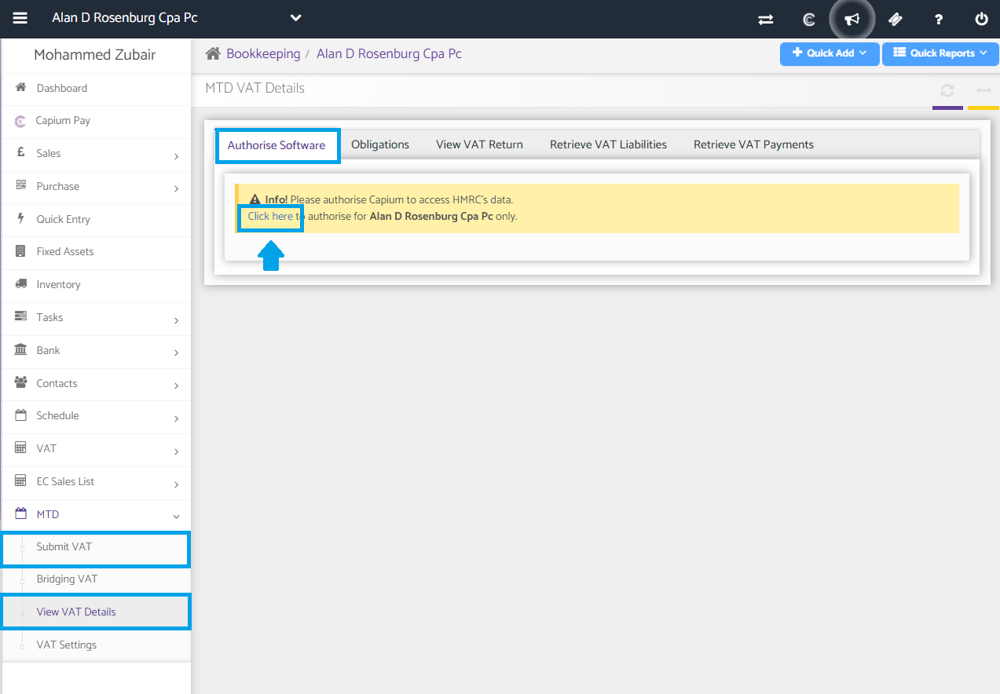

# Making Tax Digital for VAT - Authorise Capium to submit your client’s VAT returns
	 	
			
			Print

- **Category:** Bookkeeping
- **Folder:** MTD
- **Source URL:** [https://capium.freshdesk.com/support/solutions/articles/9000236944-making-tax-digital-for-vat-authorise-capium-to-submit-your-client-s-vat-returns](https://capium.freshdesk.com/support/solutions/articles/9000236944-making-tax-digital-for-vat-authorise-capium-to-submit-your-client-s-vat-returns)
- **Article ID:** 9000236944

## Content

Solution home 
		Bookkeeping
		MTD

### Making Tax Digital for VAT - Authorise Capium to submit your client’s VAT returns

			Print

	Modified on: Mon, 18 Mar, 2024 at  4:26 PM

		Navigation: Bookkeeping module >> Client Specific >> MTD >> View VAT Details >> Authorise Software.

Click where it states 'Click here to authorise for the respective client only'. 

You will be redirected to ‘https://www.tax.service.gov.uk/’ for authorisation. 

Once completed, you will automatically be redirected back to Capium.

Note: You will need to authorise each client individually. 

										Did you find it helpful?
								Yes
								No

Send feedback	Sorry we couldn't be helpful. Help us improve this article with your feedback.

## Screenshots & Diagrams (1)

