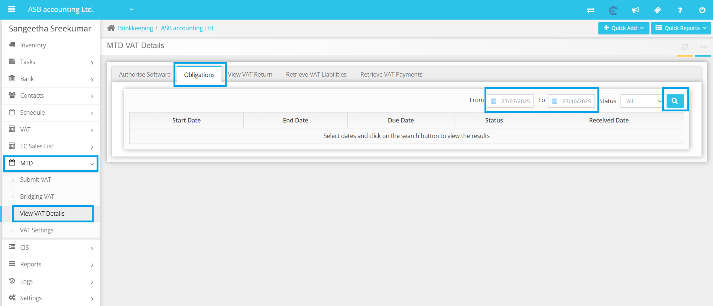
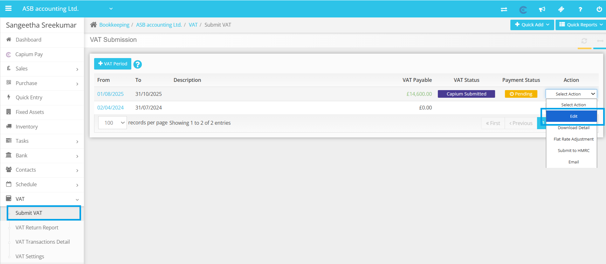
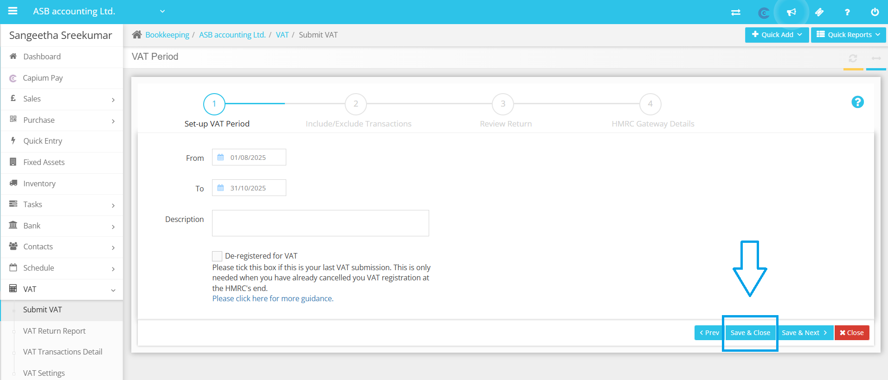
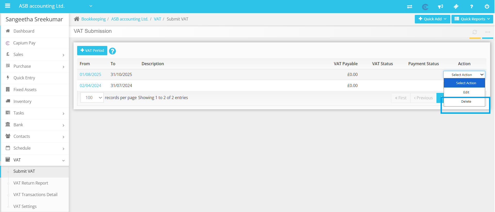

# INVALID_REQUEST - Invalid request PERIOD_KEY_INVALID - period key should be a 4 character string -/periodKey
	 	
			
			Print

- **Category:** Bookkeeping
- **Folder:** Bookkeeping Help Guide
- **Source URL:** [https://capium.freshdesk.com/support/solutions/articles/9000271599-invalid-request-invalid-request-period-key-invalid-period-key-should-be-a-4-character-string-pe](https://capium.freshdesk.com/support/solutions/articles/9000271599-invalid-request-invalid-request-period-key-invalid-period-key-should-be-a-4-character-string-pe)
- **Article ID:** 9000271599

## Content

Solution home 
		Bookkeeping
		Bookkeeping Help Guide

### INVALID_REQUEST - Invalid request PERIOD_KEY_INVALID - period key should be a 4 character string -/periodKey

			Print

	Modified on: Mon, 27 Oct, 2025 at  1:40 PM

		If you are encountering an error 'INVALID_REQUEST - Invalid request PERIOD_KEY_INVALID - period key should be a 4 character string -/periodKey' while trying to submit your VAT return, it may be due to an invalid VAT period being added.

Here are the steps to resolve this issue:

1. Check and add the correct open VAT period given by HMRC by navigating to MTD (Making Tax Digital) >> View VAT Details >> Obligation >> From and To Date >> Click on the search box.

2. Once you have the correct open period, add it under MTD >> Submit VAT/Bridging VAT section.

3. Try to submit the return again.

Please be advised that if you have previously entered incorrect periods, you should first delete them and then add the periods in accordance with HMRC obligations. Failure to do so may result in the rejection of your return due to invalid periods.

Note: To delete the VAT period submitted in Capium, please navigate to MTD >> Submit VAT/Bridging VAT section >> Select action >> Edit >> Save and close. After completing this process, refresh the page, and you will find the delete option available in the select action dropdown.

If you continue to face difficulties after following these steps, please reach out to our customer support team for further assistance. We are here to help you resolve any issues you may encounter with VAT submissions.

										Did you find it helpful?
								Yes
								No

Send feedback	Sorry we couldn't be helpful. Help us improve this article with your feedback.

## Screenshots & Diagrams (4)

