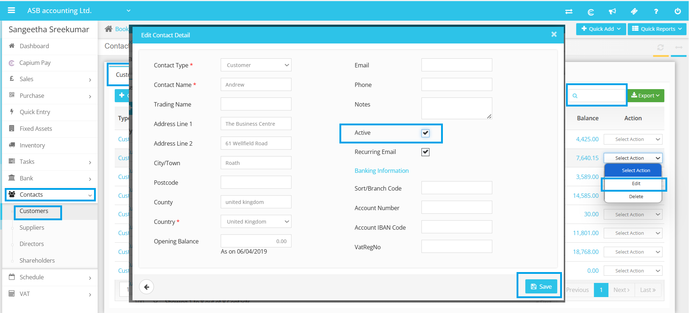

# Unable to select customer while creating invoice
	 	
			
			Print

- **Category:** Bookkeeping
- **Folder:** Bookkeeping Help Guide
- **Source URL:** [https://capium.freshdesk.com/support/solutions/articles/9000272314-unable-to-select-customer-while-creating-invoice](https://capium.freshdesk.com/support/solutions/articles/9000272314-unable-to-select-customer-while-creating-invoice)
- **Article ID:** 9000272314

## Content

Solution home 
		Bookkeeping
		Bookkeeping Help Guide

### Unable to select customer while creating invoice

			Print

	Modified on: Thu, 13 Nov, 2025 at  1:27 PM

		Unable to Select Customer While Creating Invoice

If you are experiencing difficulties selecting a customer while creating an invoice, it is likely because the customer is marked as inactive in the system. Follow the detailed steps below to mark the customer as active and resolve the problem.

1. Navigate to Contacts → Customers: Start by accessing the "Contacts" section in your system. From there, click on "Customers." This area lists all your existing customer records, allowing you to manage their statuses effectively. 

2. Search for the Specific Client: Use the search bar located at the top of the Customers page to quickly locate the customer you wish to update. Enter the customer's name or any identifying information, such as their email or phone number, to streamline your search. 

3. Check Customer Status: Once you find the customer record, look for the “Active” checkbox beside their name. This checkbox indicates whether the customer is currently active in the system. If the box is unchecked, it means the customer is inactive, which is why you cannot select them while creating an invoice.

4. Edit Customer Status: Click on the "Select Action" dropdown menu next to the customer’s name and choose "Edit." In the edit mode, tick the active checkbox to change their status from inactive to active. This action ensures that the customer’s details are now available for use in transactions, including invoice creation, and will also reflect in your reports, allowing for accurate tracking of your customer interactions.

5. Verify Changes: After completing these steps, please check your active customer list to confirm that the customer now appears. This verification step is crucial to ensure that the changes have been successfully applied. You can refresh the page or navigate back to the invoice creation section to see if the customer is now selectable.

If you continue to face any difficulties or if the changes are not reflected as expected, please do not hesitate to reach out to our customer support team. We are here to assist you and ensure that your invoicing process runs smoothly! Your satisfaction is our priority, and we are committed to helping you resolve any issues you may encounter.

										Did you find it helpful?
								Yes
								No

Send feedback	Sorry we couldn't be helpful. Help us improve this article with your feedback.

## Screenshots & Diagrams (1)

