# Capisign v2.0 Module - Knowledge Base & Feature Index

> Total Articles: **16** | Module Directory: `d:/sansuite/Capisign v2.0`

## Articles List & Local Assets

### 1. Single document upload in Capisign
- **Folder:** &#39;How to&#39;
- **Article ID:** `9000225368` | **Slug:** `single-document-upload-in-capisign`
- **Markdown File:** [raw_articles/9000225368_single-document-upload-in-capisign.md](../raw_articles/9000225368_single-document-upload-in-capisign.md)
- **Images Count:** 6
- **Screenshots:**
  - 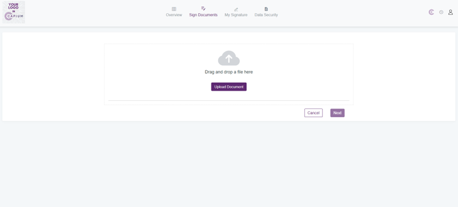
  - 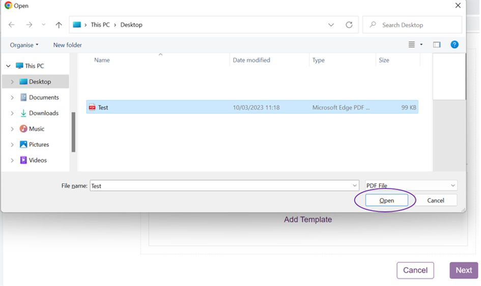
  - 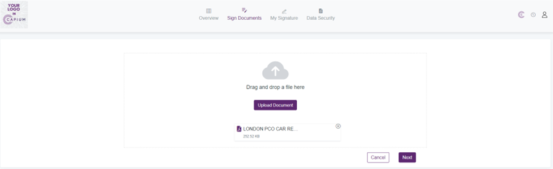
  - 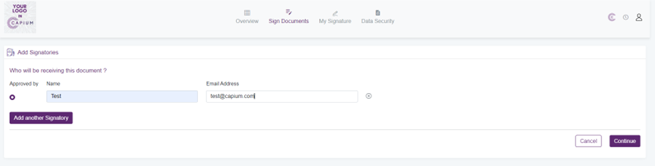
  - 
  - 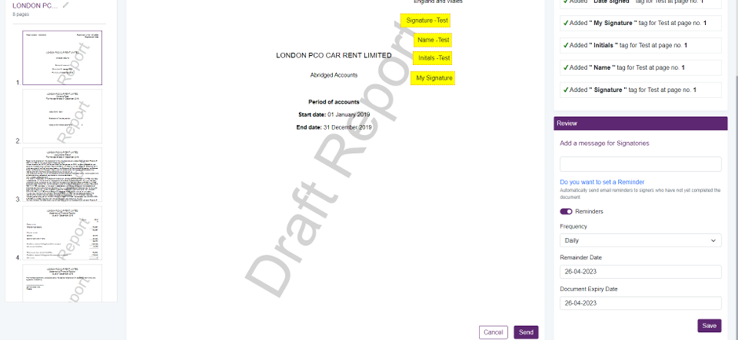

---

### 2. End user single document signing
- **Folder:** &#39;How to&#39;
- **Article ID:** `9000225379` | **Slug:** `end-user-single-document-signing`
- **Markdown File:** [raw_articles/9000225379_end-user-single-document-signing.md](../raw_articles/9000225379_end-user-single-document-signing.md)
- **Images Count:** 4
- **Screenshots:**
  - 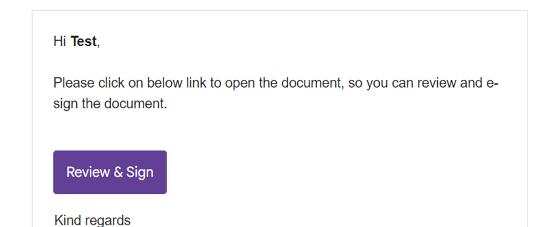
  - 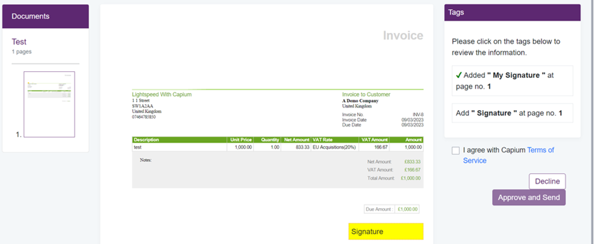
  - 
  - 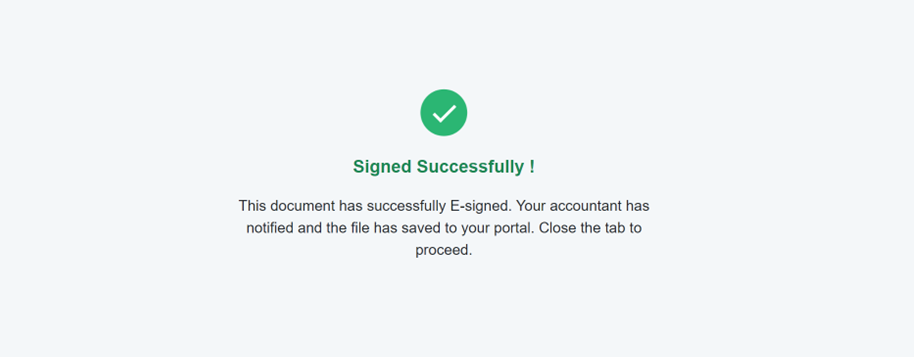

---

### 3. Multiple document upload in Capisign
- **Folder:** &#39;How to&#39;
- **Article ID:** `9000225707` | **Slug:** `multiple-document-upload-in-capisign`
- **Markdown File:** [raw_articles/9000225707_multiple-document-upload-in-capisign.md](../raw_articles/9000225707_multiple-document-upload-in-capisign.md)
- **Images Count:** 6
- **Screenshots:**
  - 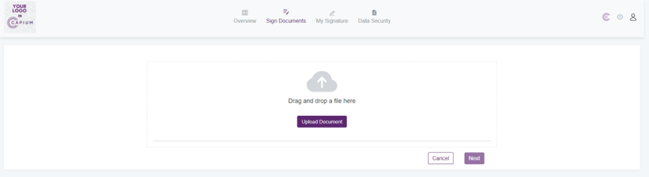
  - 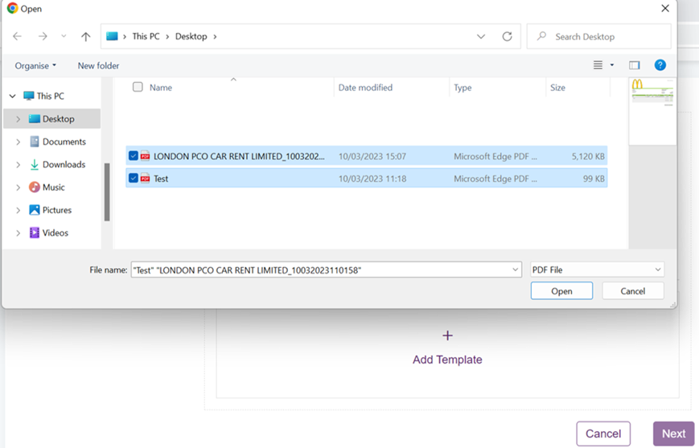
  - 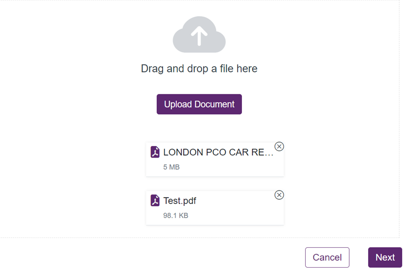
  - 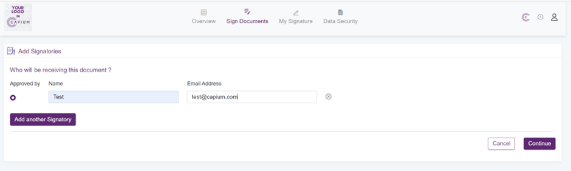
  - 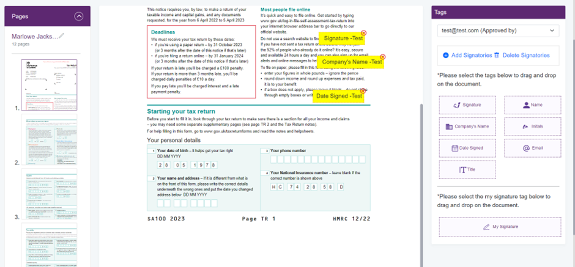
  - 

---

### 4. End user multiple documents signing
- **Folder:** &#39;How to&#39;
- **Article ID:** `9000225733` | **Slug:** `end-user-multiple-documents-signing`
- **Markdown File:** [raw_articles/9000225733_end-user-multiple-documents-signing.md](../raw_articles/9000225733_end-user-multiple-documents-signing.md)
- **Images Count:** 6
- **Screenshots:**
  - 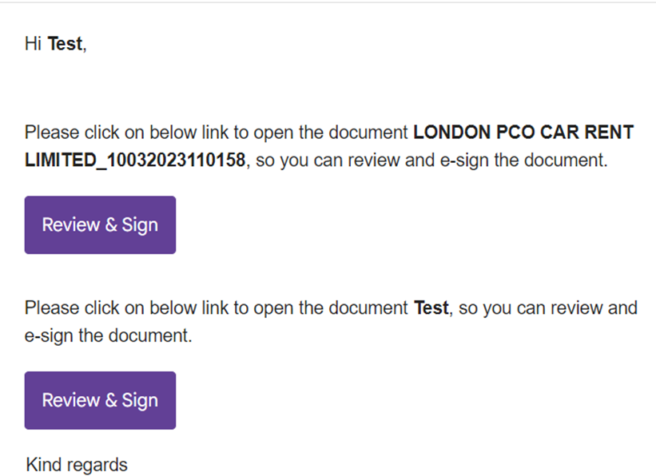
  - 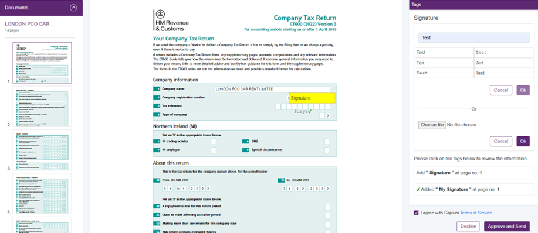
  - 
  - 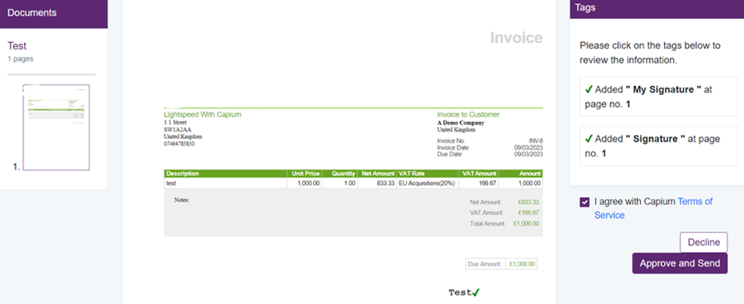
  - 
  - 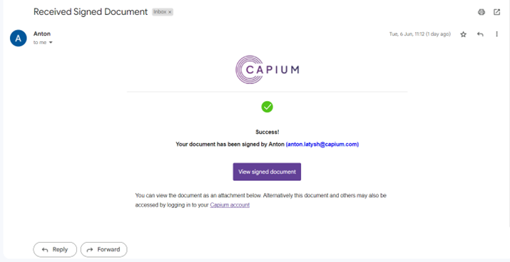

---

### 5. Complete Overview of Capisign
- **Folder:** &#39;How to&#39;
- **Article ID:** `9000225737` | **Slug:** `complete-overview-of-capisign`
- **Markdown File:** [raw_articles/9000225737_complete-overview-of-capisign.md](../raw_articles/9000225737_complete-overview-of-capisign.md)
- **Images Count:** 0

---

### 6. How to secure documents using password protection
- **Folder:** &#39;How to&#39;
- **Article ID:** `9000226873` | **Slug:** `how-to-secure-documents-using-password-protection`
- **Markdown File:** [raw_articles/9000226873_how-to-secure-documents-using-password-protection.md](../raw_articles/9000226873_how-to-secure-documents-using-password-protection.md)
- **Images Count:** 2
- **Screenshots:**
  - 
  - 

---

### 7. How to rename a document within Capisign
- **Folder:** &#39;How to&#39;
- **Article ID:** `9000240724` | **Slug:** `how-to-rename-a-document-within-capisign`
- **Markdown File:** [raw_articles/9000240724_how-to-rename-a-document-within-capisign.md](../raw_articles/9000240724_how-to-rename-a-document-within-capisign.md)
- **Images Count:** 3
- **Screenshots:**
  - 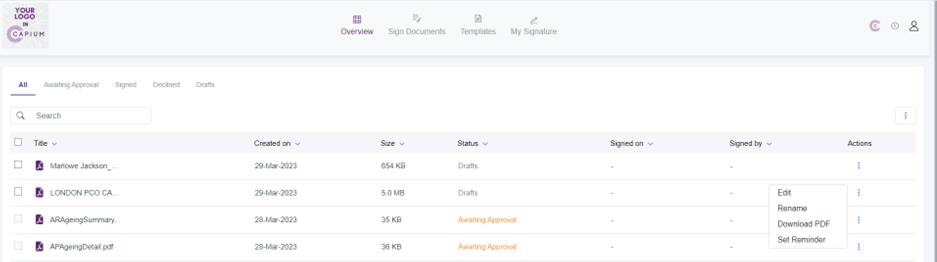
  - 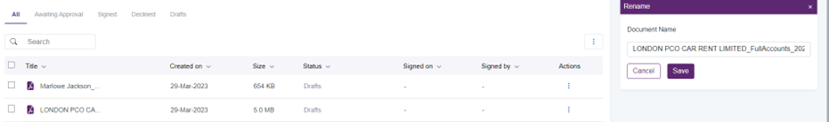
  - 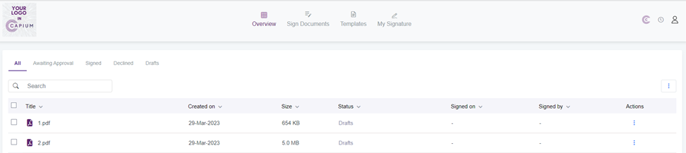

---

### 8. Creating Email Templates in CapiSign
- **Folder:** &#39;How to&#39;
- **Article ID:** `9000247188` | **Slug:** `creating-email-templates-in-capisign`
- **Markdown File:** [raw_articles/9000247188_creating-email-templates-in-capisign.md](../raw_articles/9000247188_creating-email-templates-in-capisign.md)
- **Images Count:** 0

---

### 9. Setting Up CapiSign
- **Folder:** &#39;How to&#39;
- **Article ID:** `9000247190` | **Slug:** `setting-up-capisign`
- **Markdown File:** [raw_articles/9000247190_setting-up-capisign.md](../raw_articles/9000247190_setting-up-capisign.md)
- **Images Count:** 0

---

### 10. Setting Up Your Signature in CapiSign
- **Folder:** &#39;How to&#39;
- **Article ID:** `9000247194` | **Slug:** `setting-up-your-signature-in-capisign`
- **Markdown File:** [raw_articles/9000247194_setting-up-your-signature-in-capisign.md](../raw_articles/9000247194_setting-up-your-signature-in-capisign.md)
- **Images Count:** 0

---

### 11. Managing Drafts: Archiving and Deleting
- **Folder:** &#39;How to&#39;
- **Article ID:** `9000247196` | **Slug:** `managing-drafts-archiving-and-deleting`
- **Markdown File:** [raw_articles/9000247196_managing-drafts-archiving-and-deleting.md](../raw_articles/9000247196_managing-drafts-archiving-and-deleting.md)
- **Images Count:** 0

---

### 12. Sending Documents for E-Signature using CapiSign
- **Folder:** &#39;How to&#39;
- **Article ID:** `9000247197` | **Slug:** `sending-documents-for-e-signature-using-capisign`
- **Markdown File:** [raw_articles/9000247197_sending-documents-for-e-signature-using-capisign.md](../raw_articles/9000247197_sending-documents-for-e-signature-using-capisign.md)
- **Images Count:** 0

---

### 13. Capisign: Sending a file from Accounts Production to get e-signing
- **Folder:** Capisign Help Guide
- **Article ID:** `9000225487` | **Slug:** `capisign-sending-a-file-from-accounts-production-to-get-e-signing`
- **Markdown File:** [raw_articles/9000225487_capisign-sending-a-file-from-accounts-production-to-get-e-signing.md](../raw_articles/9000225487_capisign-sending-a-file-from-accounts-production-to-get-e-signing.md)
- **Images Count:** 4
- **Screenshots:**
  - 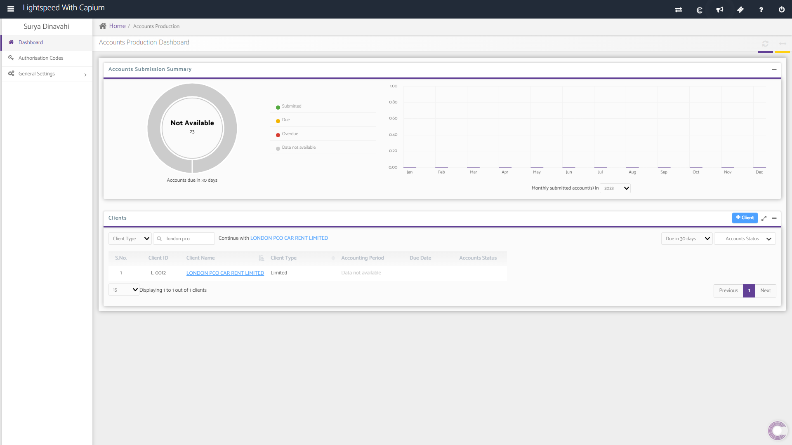
  - 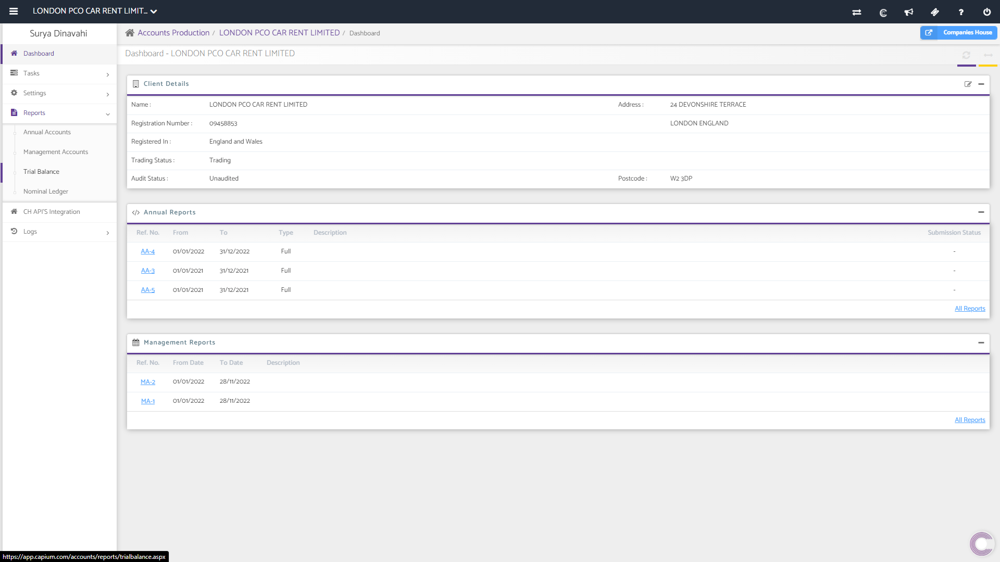
  - 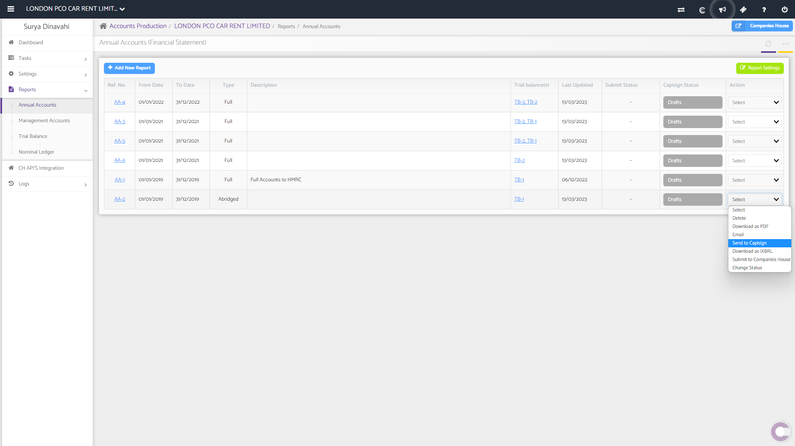
  - 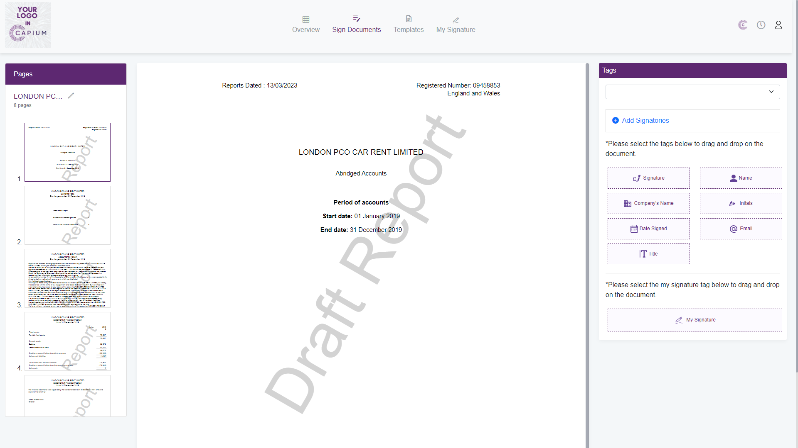

---

### 14. Capisign: Sending a file from Corporation Tax for e-signing
- **Folder:** Capisign Help Guide
- **Article ID:** `9000225488` | **Slug:** `capisign-sending-a-file-from-corporation-tax-for-e-signing`
- **Markdown File:** [raw_articles/9000225488_capisign-sending-a-file-from-corporation-tax-for-e-signing.md](../raw_articles/9000225488_capisign-sending-a-file-from-corporation-tax-for-e-signing.md)
- **Images Count:** 4
- **Screenshots:**
  - 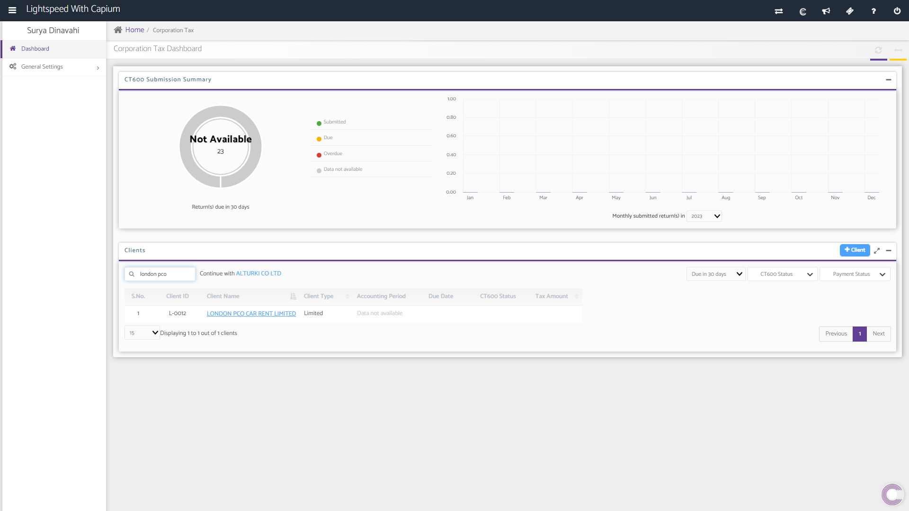
  - 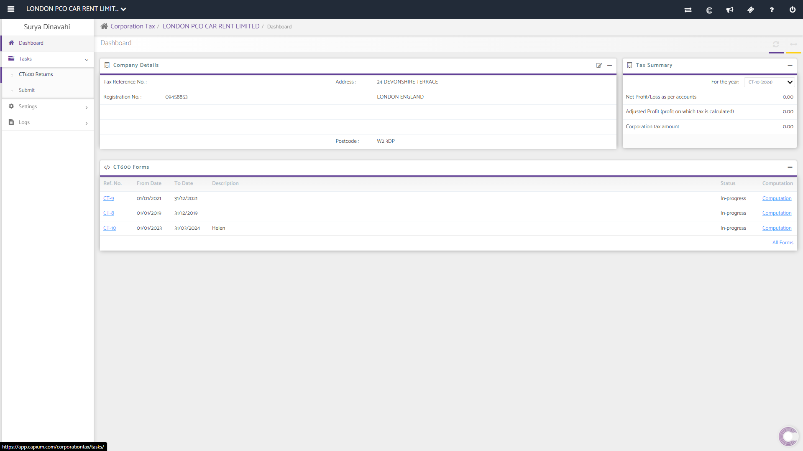
  - 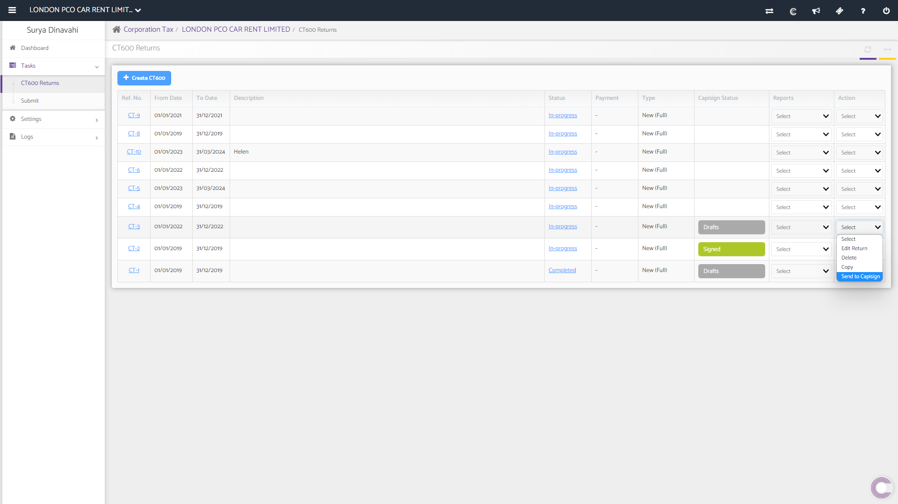
  - 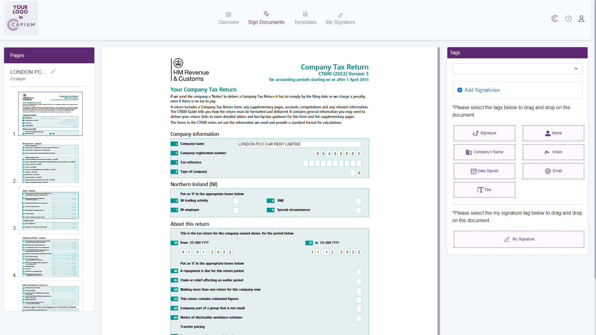

---

### 15. Capisign: Sending a file from Self Assessment for e-signing
- **Folder:** Capisign Help Guide
- **Article ID:** `9000225736` | **Slug:** `capisign-sending-a-file-from-self-assessment-for-e-signing`
- **Markdown File:** [raw_articles/9000225736_capisign-sending-a-file-from-self-assessment-for-e-signing.md](../raw_articles/9000225736_capisign-sending-a-file-from-self-assessment-for-e-signing.md)
- **Images Count:** 3
- **Screenshots:**
  - 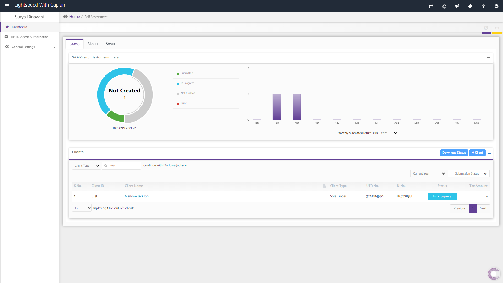
  - 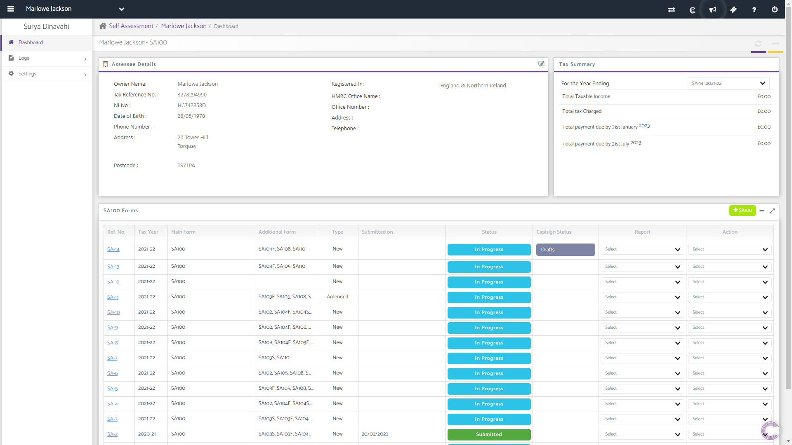
  - 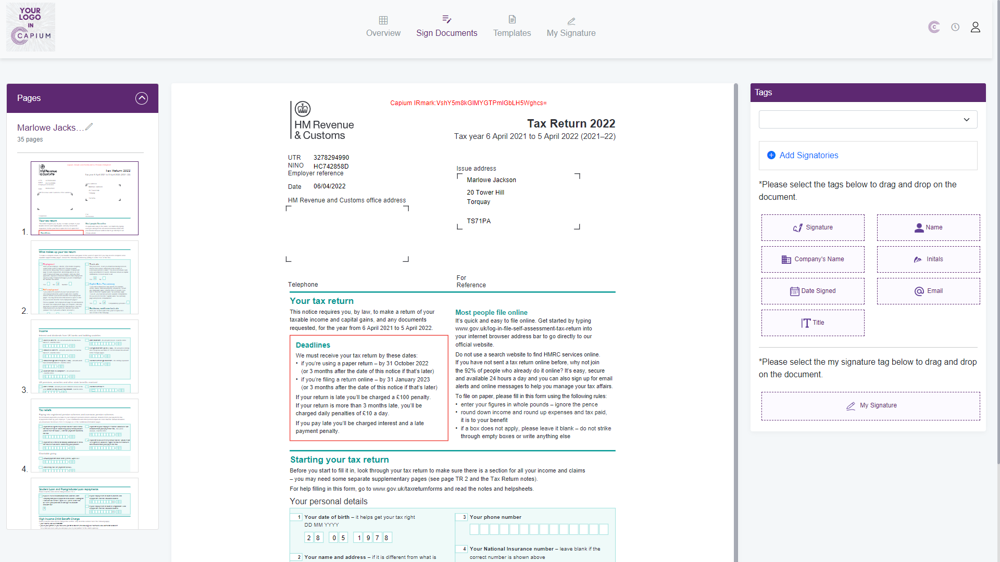

---

### 16. Delete Draft Document from Capisign
- **Folder:** Capisign Help Guide
- **Article ID:** `9000271450` | **Slug:** `delete-draft-document-from-capisign`
- **Markdown File:** [raw_articles/9000271450_delete-draft-document-from-capisign.md](../raw_articles/9000271450_delete-draft-document-from-capisign.md)
- **Images Count:** 4
- **Screenshots:**
  - 
  - 
  - 
  - 

---

