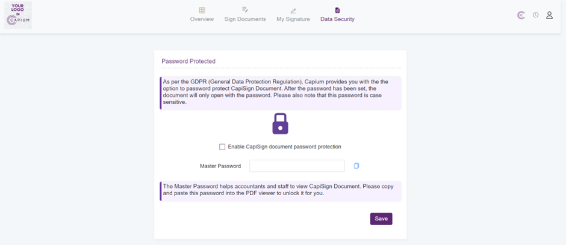
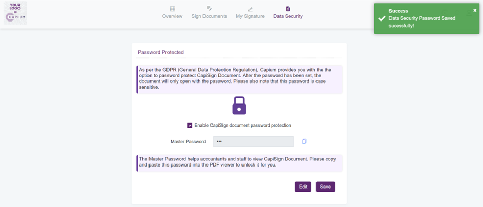

# How to secure documents using password protection
	 	
			
			Print

- **Category:** Capisign v2.0
- **Folder:** &#39;How to&#39;
- **Source URL:** [https://capium.freshdesk.com/support/solutions/articles/9000226873-how-to-secure-documents-using-password-protection](https://capium.freshdesk.com/support/solutions/articles/9000226873-how-to-secure-documents-using-password-protection)
- **Article ID:** 9000226873

## Content

Solution home 
		Capisign v2.0
		&#39;How to&#39;

### How to secure documents using password protection

			Print

	Modified on: Tue, 25 Apr, 2023 at  3:37 PM

		To secure documents using password protection. 

Navigation: Capisign > Data Security

Following the navigation process, a user is able to create a master password to protect documents.

Once performed, a user is required to enable the CapiSign document password protection option and save a created master password. If required, a user is able to change the password by clicking the 'Edit' button.

										Did you find it helpful?
								Yes
								No

Send feedback	Sorry we couldn't be helpful. Help us improve this article with your feedback.

## Screenshots & Diagrams (2)

