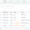
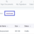
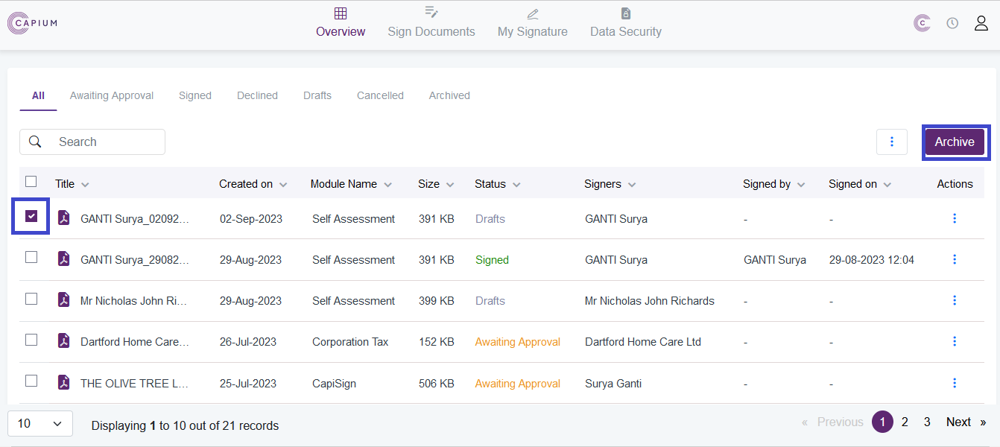
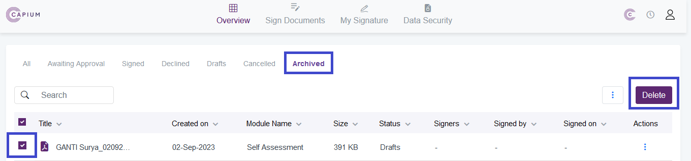

# Delete Draft Document from Capisign
	 	
			
			Print

- **Category:** Capisign v2.0
- **Folder:** Capisign Help Guide
- **Source URL:** [https://capium.freshdesk.com/support/solutions/articles/9000271450-delete-draft-document-from-capisign](https://capium.freshdesk.com/support/solutions/articles/9000271450-delete-draft-document-from-capisign)
- **Article ID:** 9000271450

## Content

Solution home 
		Capisign v2.0
		Capisign Help Guide

### Delete Draft Document from Capisign

			Print

	Modified on: Thu, 23 Oct, 2025 at  9:20 AM

		We understand that you may need to delete draft documents from time to time, and we're here to help you with that. Follow the steps below to remove draft documents from CapiSign:

1. Navigate to CapiSign and check the box for the document you want to remove. Then, click on "Archive" (refer to the attachment for visual guidance).

2. After completing step 1, go to the Archived section in CapiSign, check the box for the document, and click on "Delete" (refer to the attachment for visual guidance).

3. Once you have completed the above steps, navigate to the respective module, select the specific client, click on "Action," and then click on "Send to CapiSign."

By following these steps, you will be able to successfully delete draft documents from CapiSign. If you have any further questions or need additional assistance, please don't hesitate to reach out to our customer support team.

		Capisign Arc... (54 KB) Capisign Del... (28 KB) 

										Did you find it helpful?
								Yes
								No

Send feedback	Sorry we couldn't be helpful. Help us improve this article with your feedback.

## Screenshots & Diagrams (4)

