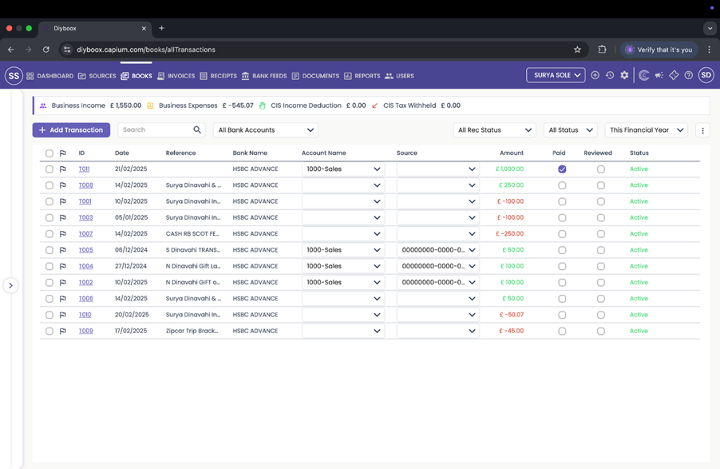
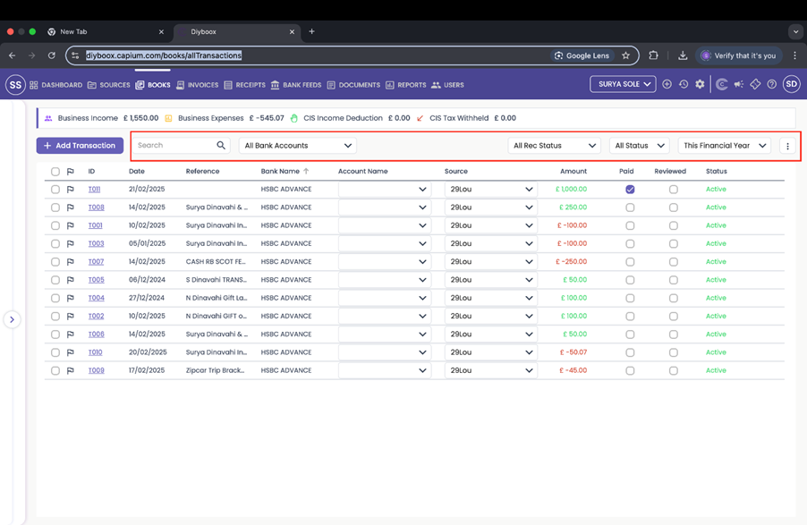
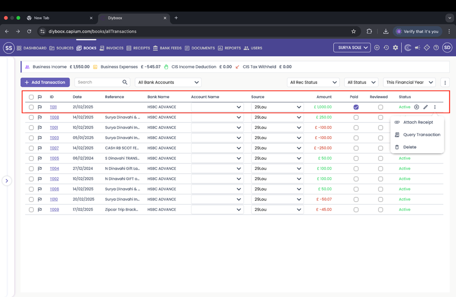
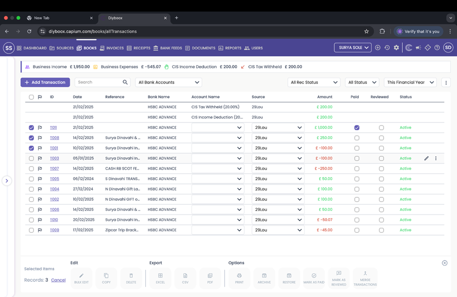
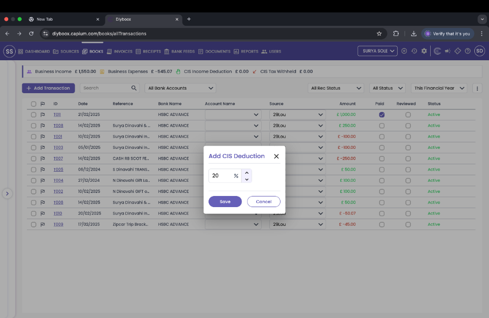
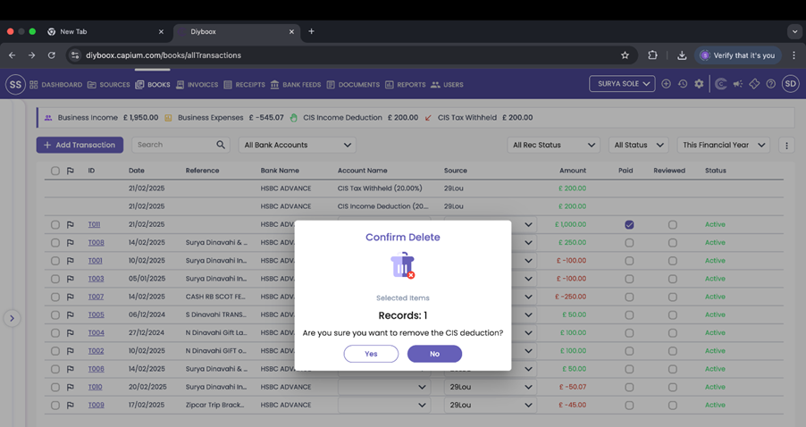
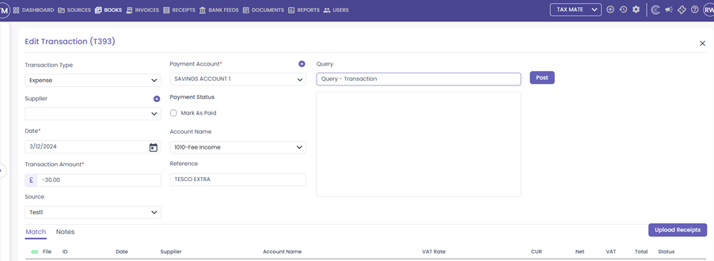
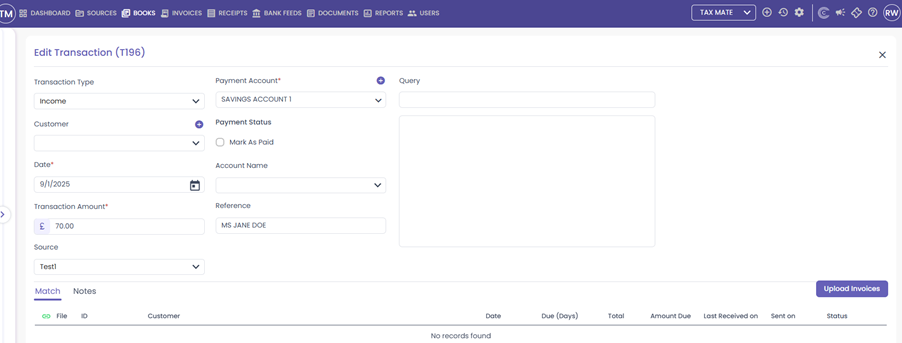

# Capium 365: Books
	 	
			
			Print

- **Category:** Capium 365
- **Folder:** Capium 365 (Accountant)
- **Source URL:** [https://capium.freshdesk.com/support/solutions/articles/9000266459-capium-365-books](https://capium.freshdesk.com/support/solutions/articles/9000266459-capium-365-books)
- **Article ID:** 9000266459

## Content

Solution home 
		Capium 365
		Capium 365 (Accountant)

### Capium 365: Books

			Print

	Modified on: Wed, 8 Oct, 2025 at  6:57 PM

		Welcome to this Capium 365 article on books! This article will walk you through the books section of Capium 365. It will show you the best practices and processes within books.

Navigation: Capium 365 Module > Select a Client (Individual or Sole Trader) > Books

Please Note: Books section is only available for individuals and sole traders who are not registered for VAT. For customers above the VAT threshold or other entities (i.e. Limited Companies and Partnerships) the software will post the invoices and purchases directly to the Bookkeeping module. 

Books section

Understanding The Books Tab

Filtering Transactions in the books tab

You can filter transactions based on:

Search: Enter any characters to quickly locate transactions across all recorded data, including references, amounts, and sources.
Bank Accounts: Select specific bank accounts to view related transactions.
Rec Status: Filter transactions based on reconciliation status.
Status: View transactions based on their current state (e.g., active, archived).
Financial Year: Narrow down records to a specific financial period.
Exporting Transactions: You can also export transactions to Excel, CSV or PDF.

Click here to go to books

### Understanding the Transactions List

Each transaction entry includes the following details:

ID: Unique identifier for the transaction.
Date: Date when the transaction was recorded.
Reference: Description or reference name.
Bank Name: The bank associated with the transaction.
Account Name: The specific account under which the transaction falls.
Source: Origin of the transaction (e.g., income, expense, adjustment).
Amount: Displays positive (income) or negative (expense) values.
Paid Status: Indicates whether the transaction is marked as paid.
Reviewed Status: Shows if the transaction has been reviewed.
Status: Displays the current state of the transaction (e.g., Active).
CIS Deduction: Allows you to add CIS deduction to your Books
Edit Transaction: 
Attach Receipt:
Query Transaction: Allows accountants to query transactions added by their clients
Delete: Removes the lines from the Books. 

### Managing Transactions

There are several ways where a user can manage the transactions in the books section.

Categorisation (Allocating nominal accounts and sources to transactions) 
Adding CIS transactions 
Creating queries and reviewing them (Sole trader +individual)
Attaching Invoices or Scans to payments
Matching transactions to purchases and sales 

### Editing Transactions

Editing Transactions 

Navigation:  Capium 365 > Books > Find the transaction you want to edit > Click the pencil icon labelled “Edit” on the right hand side > Make any changes > Click “Save and Exit”

Bulk Editing Transactions

Navigation: Capium 365 > Books > Check the boxes on the left you want to edit > OR > Click the check box in the top right to check all transactions > Select “Bulk Edit” > You can change the “Source” and “Account Name” > Select “Save”

### Adding a CIS Deduction

Navigation: Capium 365 > Books > Find an income transaction which you want to add a CIS deduction to > Click the + on the right hand side of the transaction > Type in the % of CIS deduction > Click “Save”

You will then see the CIS deduction, where you can save the percentage of the deduction. This will create two new entries as shown in the image below. 

Removing a CIS Deduction

Navigation: Capium 365 > Books Find an income transaction which you want to remove the CIS deduction from > Click the – icon on the right hand side of the transaction > Click “yes”

Querying transactions 

Navigation: Capium 365 > Books > Find the transaction you want to query > Type the query into the box in the top right > Click “Post” > The end user will be notified of their query by email

Attaching purchase invoices or invoices to transactions

There are two ways to add receipts or invoices to transactions. These are:

Attaching and uploading a purchase invoice or invoice directly to a transaction
Matching an invoice or purchase invoice directly to the transaction.
Attaching a purchase invoice or invoice directly

Navigation: Capium 365 > Books > Find the transaction you want to attach the invoice to > Click into the ID on the left hand side of the transaction > Click either “Upload Invoice” or “Upload Receipt” > Select the file > This will link the file to the transaction 

Matching a receipt or purchase invoice

Navigation: Capium 365 > Books > Find the transaction you want to attach the invoice to > Click into the ID on the left hand side of the transaction > If a receipt or purchase invoice matches similar details to the transaction it will appear on the bottom > Click the Link icon in the bottom left corner > This will link the file to the transaction

										Did you find it helpful?
								Yes
								No

Send feedback	Sorry we couldn't be helpful. Help us improve this article with your feedback.

## Screenshots & Diagrams (8)

