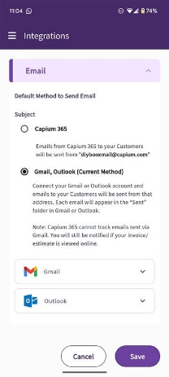

# Capium 365: Settings (App)
	 	
			
			Print

- **Category:** Capium 365
- **Folder:** Capium 365 (Mobile App)
- **Source URL:** [https://capium.freshdesk.com/support/solutions/articles/9000267610-capium-365-settings-app-](https://capium.freshdesk.com/support/solutions/articles/9000267610-capium-365-settings-app-)
- **Article ID:** 9000267610

## Content

Solution home 
		Capium 365
		Capium 365 (Mobile App)

### Capium 365: Settings (App)

			Print

	Modified on: Thu, 24 Apr, 2025 at 11:09 AM

		How to set up business information 

Navigation: Click the 3 lines on the top left hand corner of the screen > Navigate to “Settings” and click this > Select “My Business” > You have the option to fill out Business and/or individual data > Select one of these options > Fill out the data as required > Select “Save”

To begin using Capium 365, you need to set up your business. When the accountant invites you to Capium 365 most of the information should automatically be populated. If you need to add any additional information or make any changes, you need to:  

How to set up integrations 

Navigation: Navigate to “Settings” > Select “Integrations” > Select “Gmail, Outlook” > Select Gmail or Outlook where a pop up will appear > Select “Yes” > Log in to your email account > Once completed, you will be taken back to Capium 365 and the email account will be connected 

By default, all email communication done from Capium 365 is through a default Capium email. If you wish to receive replies to your emails, you can integrate your personal Gmail or outlook.

										Did you find it helpful?
								Yes
								No

Send feedback	Sorry we couldn't be helpful. Help us improve this article with your feedback.

## Screenshots & Diagrams (2)

