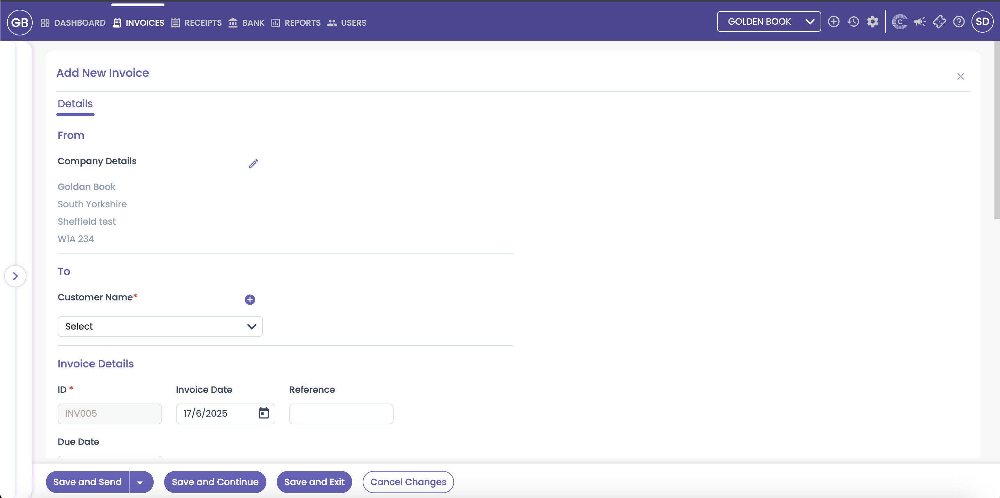
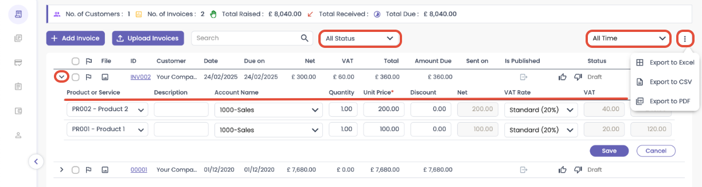

# CAPIUM 365: How to create an Invoice
	 	
			
			Print

- **Category:** Capium 365
- **Folder:** Capium 365 (Accountant)
- **Source URL:** [https://capium.freshdesk.com/support/solutions/articles/9000268888-capium-365-how-to-create-an-invoice](https://capium.freshdesk.com/support/solutions/articles/9000268888-capium-365-how-to-create-an-invoice)
- **Article ID:** 9000268888

## Content

Solution home 
		Capium 365
		Capium 365 (Accountant)

### CAPIUM 365: How to create an Invoice

			Print

	Modified on: Mon, 21 Jul, 2025 at  3:27 PM

		Below is a step-by-step guide how to create/add invoices into Capium 365

Navigation: Capium 365 > Client Portal > Invoices 

Invoices 

When you click on Invoices, you’ll be taken to the main Invoices page. From here, you can perform key invoicing tasks and view helpful summaries. There are 2 ways to add invoices:

1. Manually Raise Invoices - Create and send invoices individually. 

2. Upload Invoices in Bulk - Upload multiple invoice files at once. 

Note: Supported formats: JPG, JPEG, PNG, GIF, BMP, AVIF, HEIF, WEBP, PDF  

Maximum 50 files or a total size of 60 MB can be uploaded 

See screenshots below:

Adding Invoices:

First click onto '+add Invoice' in there 

Invoice Summary: 

At the top of the page, you'll see an overview dashboard showing: 

-Number of Customers 

-Number of Invoices 

-Total Raised 

-Total Received 

-Total Due 

This gives you a quick snapshot of your current invoicing activity and balances. 

Filters & Search: 

You can narrow down the displayed invoices using: 

Status Filters – e.g., Processing, Unpaid, Draft, Rejected

 Time Filters – e.g., Last Week, This Month, Last Month 

 Search Bar – Look up invoices by client name, invoice number, or keyword 

Viewing Invoices: 

All invoices, including recurring invoices, will appear in the list below the summary. 

You can: 

 - Collapse recurring invoices to see individual product/service lines 

 - Click into each invoice to view details or make changes 

You can export your invoice list in various formats for reporting or record-keeping: Excel, CSV and PDF. 

Want an overview of Invoices and other Areas with that? 

For a more detailed guide on how to add or bulk upload invoices, please see the help article below: 

LINK

https://capium.freshdesk.com/a/solutions/articles/9000268872?portalId=9000044273

										Did you find it helpful?
								Yes
								No

Send feedback	Sorry we couldn't be helpful. Help us improve this article with your feedback.

## Screenshots & Diagrams (5)

