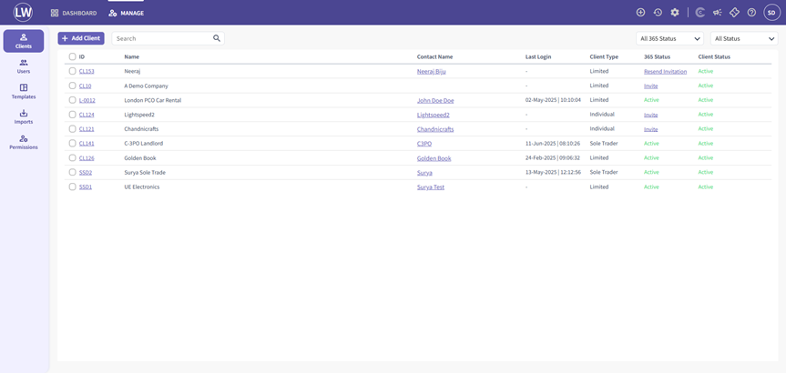
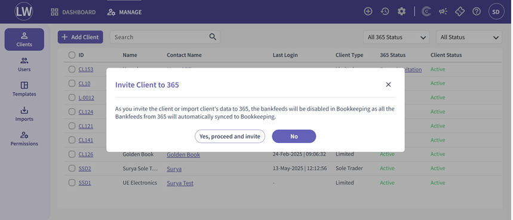

# Capium 365: Inviting your client to join
	 	
			
			Print

- **Category:** Capium 365
- **Folder:** Capium 365 (Accountant)
- **Source URL:** [https://capium.freshdesk.com/support/solutions/articles/9000269004-capium-365-inviting-your-client-to-join](https://capium.freshdesk.com/support/solutions/articles/9000269004-capium-365-inviting-your-client-to-join)
- **Article ID:** 9000269004

## Content

Solution home 
		Capium 365
		Capium 365 (Accountant)

### Capium 365: Inviting your client to join

			Print

	Modified on: Wed, 8 Oct, 2025 at  6:57 PM

		The Capium 365 client invitation feature enables accountants to seamlessly bring clients onto the platform. It simplifies the onboarding process by providing a straightforward way to grant clients access to their own secure portal, supporting real-time collaboration and enhancing the overall client experience. Please Note: Inviting a client to use Capium 365 will take up a license, regardless of the client accepting the invite. Please ensure you delete the clients who are not using Capium 365 in order to reassign the license. 

Navigation:  Capium 365 > Manage > Clients  

Locate the client you wish to invite and click the ‘Invite’ button under the ‘365 Status’ column. 

A confirmation pop-up will appear—click ‘Yes, proceed and invite’. 

Please click on this article to be redirected to how to accept the invitation and Login 

https://capium.freshdesk.com/a/solutions/articles/9000269999?portalId=9000044273

										Did you find it helpful?
								Yes
								No

Send feedback	Sorry we couldn't be helpful. Help us improve this article with your feedback.

## Screenshots & Diagrams (2)

