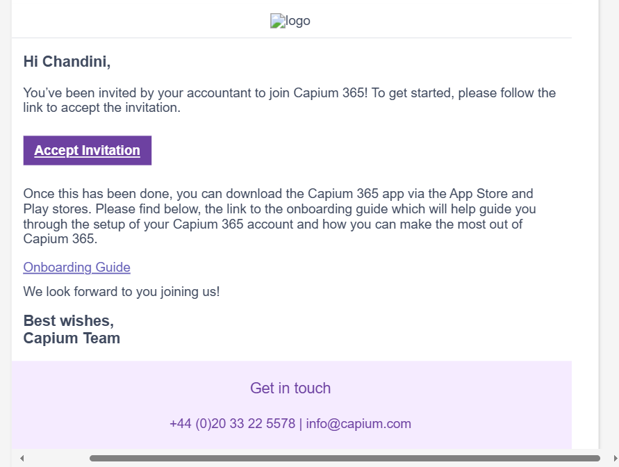
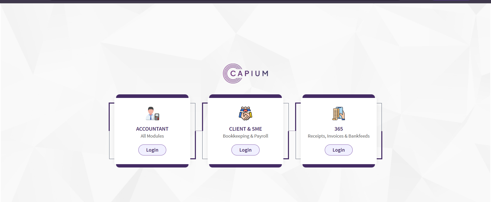
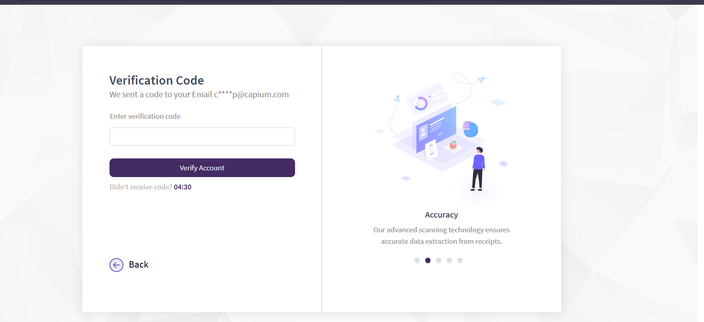
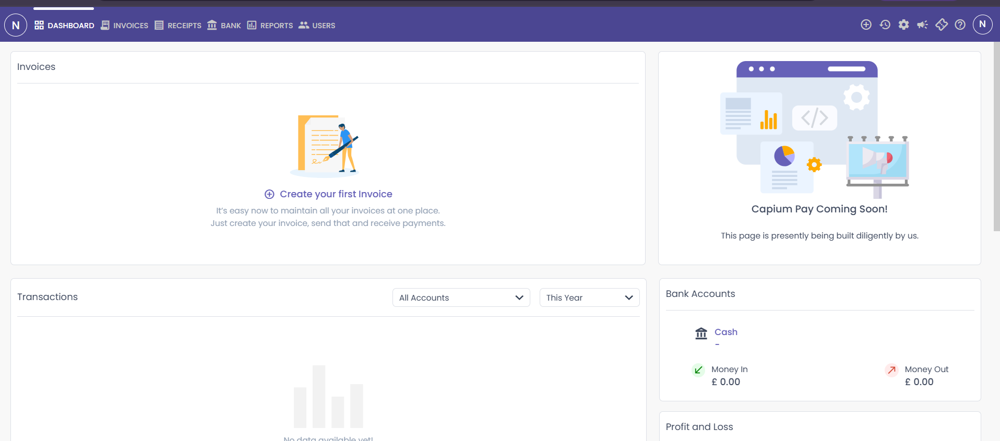

# How to log in to Capium 365? (Desktop)
	 	
			
			Print

- **Category:** Capium 365
- **Folder:** Capium 365 (Customer/Client)
- **Source URL:** [https://capium.freshdesk.com/support/solutions/articles/9000270038-how-to-log-in-to-capium-365-desktop-](https://capium.freshdesk.com/support/solutions/articles/9000270038-how-to-log-in-to-capium-365-desktop-)
- **Article ID:** 9000270038

## Content

Solution home 
		Capium 365
		Capium 365 (Customer/Client)

### How to log in to Capium 365? (Desktop)

			Print

	Modified on: Mon, 28 Jul, 2025 at 12:02 PM

		Capium 365 is a secure online portal designed for clients to access their accounting information, share documents, and stay connected with their accountant. Whether you're using the web version or the mobile app, logging in is quick and straightforward. 

###  Receive the Invitation Email

Your accountant will send you an email invitation from Capium.

Open the email and click the registration link.

Set your password and complete the registration process.

Tip: If you haven’t received the invite, check your spam/junk folder or ask your accountant to resend it.

### After accepting the link and setting the up the credentials.

### Access the Login Page

Go to: https://account.capium.com/Account/Login

You can also visit www.capium.com and select 365

Click  365 Login and enter your login deta

Enter your registered email address and the password you created

Once logged in using your credentials, you will be prompted to enter a One-Time Password (OTP) and complete the Veriphy verification process. 

After completing the verification, you will be redirected to the main login page,https://365client.capium.com/dashboard  where you are routed to the dahsboard.

Click here to How to Login into Capium 365 ? (Mobile)

Link

https://capium.freshdesk.com/a/solutions/articles/9000270039?portalId=9000044273

										Did you find it helpful?
								Yes
								No

Send feedback	Sorry we couldn't be helpful. Help us improve this article with your feedback.

## Screenshots & Diagrams (5)

