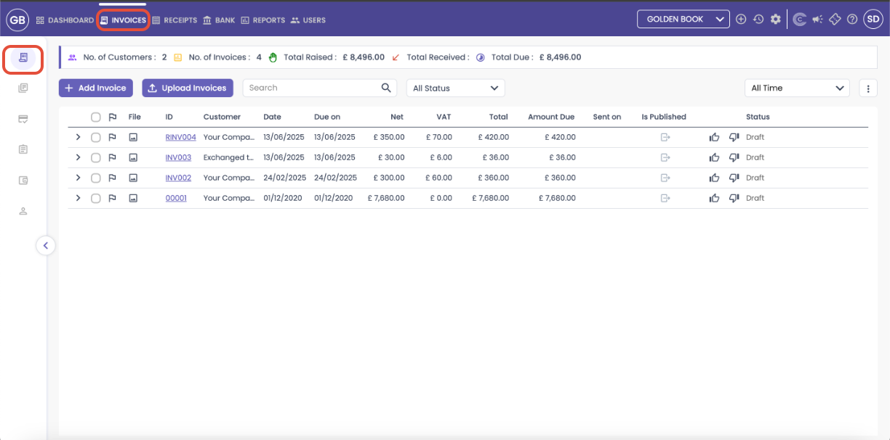
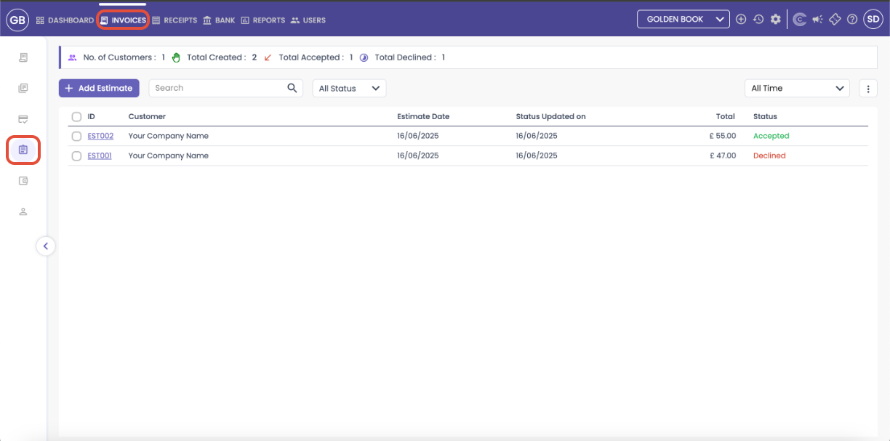
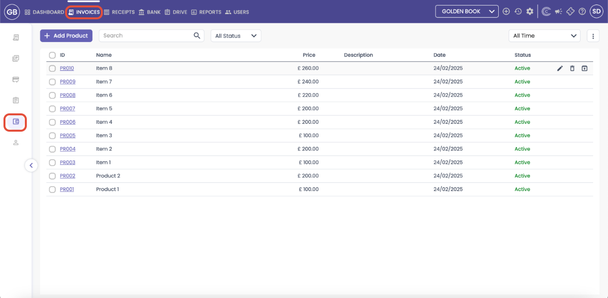

# CAPIUM 365: Invoice Overview
	 	
			
			Print

- **Category:** Capium 365
- **Folder:** Capium 365 (Customer/Client)
- **Source URL:** [https://capium.freshdesk.com/support/solutions/articles/9000270085-capium-365-invoice-overview](https://capium.freshdesk.com/support/solutions/articles/9000270085-capium-365-invoice-overview)
- **Article ID:** 9000270085

## Content

Solution home 
		Capium 365
		Capium 365 (Customer/Client)

### CAPIUM 365: Invoice Overview

			Print

	Modified on: Mon, 28 Jul, 2025 at  3:57 PM

		This article provides a overview of all the main areas within the Invoices section of Capium365, located inside the Client Portal. Whether you're issuing invoices, tracking payments, creating estimates, or managing recurring billing, each area is designed to help you streamline and stay on top of your client finances.

Areas covered:  

Invoices 
Recurring Invoices 
Credit Notes 
Estimates 
Products 
Customers 

Invoices 

Navigation: Capium 365 > Client Portal > Invoices

The Invoices section is your central hub for creating, uploading, tracking, and managing all client invoices. You can raise invoices manually or upload them in bulk (up to 50 files or 60MB).

Key Features:

View totals: Customers, Invoices, Amount Raised, Amount Received, and Outstanding
Filter invoices by status or timeframes
Use search to quickly locate any invoice
View product/service lines within each invoice by expanding them
Export data to Excel, CSV, or PDF

Need Help Adding or Uploading Invoices? 

For a more detailed guide on how to add or bulk upload invoices, please see the help article below: 

https://capium.freshdesk.com/support/solutions/articles/9000268888-capium-365-how-to-create-an-invoice

Recurring Invoices 

Navigation: Capium 365 > Client Portal > Invoices > Recurring Invoices 

### 

This section allows you to set up invoices that repeat on a regular schedule - ideal for retainers, subscription clients, or ongoing services.

This automates your billing process, reduces manual work, and ensures you never miss a scheduled payment. 

### Key Features

Set up invoices to repeat at custom intervals

Edit, pause, end, or delete recurring invoices

Export recurring billing data for financial reporting

Filter by time and status

Need Help on setting up Recurring Invoices? 

For a more detailed guide on how to set up recurring invoices, please see the help article below: 

https://capium.freshdesk.com/support/solutions/articles/9000268890-capium-365-how-to-add-recurring-invoices

Credit Notes 

Navigation: Capium365 > Client Portal > Invoices > Credit Notes 

This area lets you create and manage credit notes to correct errors, issue refunds, or apply discounts. These can be created manually or uploaded directly to send and allocate against invoices (50 files or 60MB max).

Maintaining accurate credit records is key for compliance, customer trust, and accounting transparency.

### 

### Key Features

Manually create or upload credit notes

View and edit credit note amounts (Net, VAT, Total)

Edit, split, send, duplicate, or view credit history

Export to Excel, CSV, or PDF

Need help on how to create, upload, and allocate credit notes? 

For a more detailed guide on how to create, upload, and allocate credit notes, please see the help article below: 

https://capium.freshdesk.com/support/solutions/articles/9000268891-capium-365-how-to-add-send-credit-notes

Estimates 

Navigation: Capium 365 > Client Portal > Invoices > Estimates 

The estimates section helps you send quotes to clients before invoicing begins. You can track accepted, declined, or pending estimates easily.

Sending estimates builds professionalism, increases your chances of winning work, and helps you manage your sales pipeline more effectively.

### Key Features

Create and send estimates 

Track total estimates, accepted/declined numbers

Filter by status and date

Export estimates to Excel, CSV, or PDF

Mark estimates as sent, accepted, declined, or print-ready

Need help on how to create, send, and manage estimates? 

For a more detailed guide on how to create, send, and manage estimates, please see the help article below: 

https://capium.freshdesk.com/support/solutions/articles/9000268893-capium-365-how-to-create-send-estimates-to-your-clients

Products 

Navigation: Capium 365 > Client Portal > Invoices > Products 

This section stores a list of standard products or services with pre-defined pricing.

Using predefined items speeds up invoice creation, ensures pricing consistency, and gives you visibility over every product.

### Key Features

Add/edit product details like name, price, and description

View change history for each item

Filter by status and time

Export product data to Excel, CSV, or PDF

Need help on how to  add, update, or manage products? 

For a more detailed guide on how to  add, update, or manage products, please see the help article below: 

https://capium.freshdesk.com/support/solutions/articles/9000268894-capium-365-how-to-add-products

Customers 

Navigation: Capium 365 > Client Portal > Invoices > Customer 

The customers section is the client database within the invoicing module. It stores all customer-related billing info and links directly to invoices, estimates, and credit notes.

Keeping accurate client records makes billing seamless, reporting more precise, and saves time when generating documents.

### Key Features

Add/edit customer profiles with billing and contact details

View full financial history per customer

Filter by timeframe or status

Search and export the customer list

Need help on how to  add, update, or manage products? 

For a more detailed guide on how to  add, update, or manage products, please see the help article below: 

https://capium.freshdesk.com/a/solutions/articles/9000269499?portalId=9000044273

Click on the link below to learn more about how to create receipts in Capium 365:

https://capium.freshdesk.com/support/solutions/articles/9000269008-capium-365-receipts

Click on the link below to learn more about Bank in Capium 365: 

https://capium.freshdesk.com/support/solutions/articles/9000269006-capium-365-bank 

										Did you find it helpful?
								Yes
								No

Send feedback	Sorry we couldn't be helpful. Help us improve this article with your feedback.

## Screenshots & Diagrams (6)

