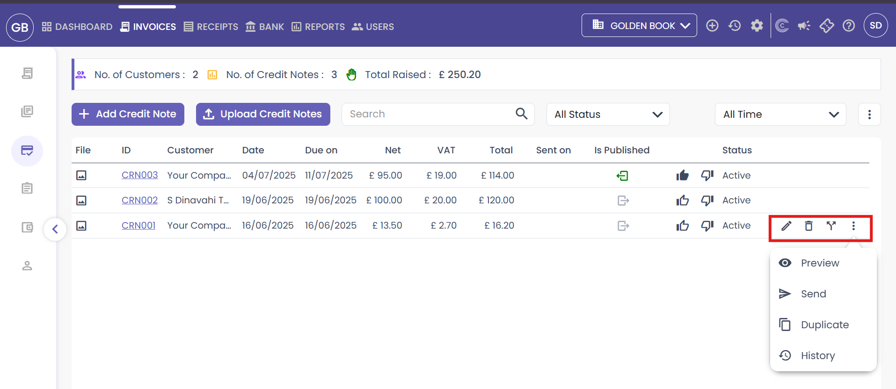

# CAPIUM 365: How to add &amp; Send Credit Notes
	 	
			
			Print

- **Category:** Capium 365
- **Folder:** Capium 365 (Customer/Client)
- **Source URL:** [https://capium.freshdesk.com/support/solutions/articles/9000270107-capium-365-how-to-add-send-credit-notes](https://capium.freshdesk.com/support/solutions/articles/9000270107-capium-365-how-to-add-send-credit-notes)
- **Article ID:** 9000270107

## Content

Solution home 
		Capium 365
		Capium 365 (Customer/Client)

### CAPIUM 365: How to add & Send Credit Notes

			Print

	Modified on: Tue, 29 Jul, 2025 at 11:40 AM

		The article below is a step-by-step guide on create and send Credit Notes.

Navigation: Capium 365 > Client Portal > Invoices > Credit Notes 

Two Options:

Add credit Note Manually
Upload credit notes in bulk

Please refer the Screenshot below

Please refer the below Screenshot:

Note: Supported formats: JPG, JPEG, PNG, GIF, BMP, AVIF, HEIF, WEBP, PDF  

Maximum 50 files or a total size of 60 MB can be uploaded 

Once it’s been created you will see the list of credit notes and other details that you can see like: 

-File 

- Date & Due date 

- Net, Vat & Total (which you can amend from the main screen too) 

- Published and the status 

You can export as: Excel, CSV and PDF 

Once created or uploaded, credit notes are displayed in a structured list view. For each credit note, you can see: 

- File Name (if any supporting files were uploaded) 

-Date & Due Date 

-Net Amount, VAT, and Total (These fields can be amended directly from the main screen, without opening the credit note) 

-Published Status 

-Status 

Existing Credit Notes 

When you  over any credit note in the list, the following action icons appear on the right-hand side: 

Edit – Change any field including dates, client, or amounts 

Split – Divide the credit into multiple parts if needed for partial allocations 

Send – Email the credit note directly to the client 

Duplicate – Create a copy to reuse for a similar case 

View History – View activity log including when it was created, edited, or sent 

										Did you find it helpful?
								Yes
								No

Send feedback	Sorry we couldn't be helpful. Help us improve this article with your feedback.

## Screenshots & Diagrams (4)

